```python
import numpy as np
import pandas as pd
import re
import scipy.stats as st
import sklearn.metrics as met
import matplotlib.pyplot as plt
import sklearn.preprocessing as prep
import time

#%matplotlib inline 可以在Ipython编译器里直接使用，功能是可以内嵌绘图，并且可以省略掉plt.show()这一步。
%matplotlib inline
title = "PPD"
path = "C:/Users/recre/OneDrive/Stat"
icy = 'target'
```

# PPD

## Initiate Data

Read data from orginal data files, save them into database which is easier to reload

### Master Data
Input:
* Training Master Data:
    * PPD_dat_1.csv: First-round training set of Master data
    * PPD_dat_2.csv: First-round validation set of Master data
    * PPD_dat_3.csv: Second-round training set of Master data
    * PPD_dayt_2_1.csv: First-round public validation set of Y Labels
    * PPD_dayt_2_2.csv: First-round private validation set of Y Labels
* Validation Master Data:
    * PPD_dav.csv: Second-round validation set of Master data
    
Output:
* da: master data
* irt, irv: sample indices of training and validation set


```python
def Read_concat_csv(file, par_csv = {}):
    da = pd.concat(map(lambda x: pd.read_csv(x, **par_csv), file))
    return(da)
def Del_string(xstr):
    xstrc = xstr.strip().strip("市").strip("省")
    if(xstrc == ""):
        xstrc = np.nan
    return(xstrc)
```
par_csv = dict(index_col = 0, encoding = "GB18030", parse_dates = ["ListingInfo"], na_values = [-1], 
               converters = dict(zip(*[["UserInfo_{}".format(i) for i in [9, 2, 4, 8, 20, 7, 19]], [Del_string]*7])))
file_dat = ["{}/{}_dat_{}.csv".format(path, title, 1+x) for x in range(3)]
file_dayt = ["{}/{}_dayt_2_{}.csv".format(path, title, x) for x in [1, 2]]
file_dav = ["{}/{}_dav.csv".format(path, title)]
dat = Read_concat_csv(file_dat, par_csv).fillna(Read_concat_csv(file_dayt, {"index_col": 0}))
dav = Read_concat_csv(file_dav, par_csv)
np.save("{}/{}_irt.npy".format(path, title), list(dat.index))
np.save("{}/{}_irv.npy".format(path, title), list(dav.index))
da = pd.concat([dat, dav])
da.to_hdf("{}/{}_da.h5".format(path, title), key = "da", complib = "zlib", complevel = 1, mode = "w")
### Historical Records Data
Input:
* LogInfo Data:
    * PPD_daht_1_LogInfo.csv: First-round training set of LogInfo data
    * PPD_daht_2_LogInfo.csv: First-round validation set of LogInfo data
    * PPD_daht_3_LogInfo.csv: Second-round training set of LogInfo data
    * PPD_dahv_LogInfo.csv: Second-round validation set of LogInfo data
* UserupdateInfo Data:
    * PPD_daht_1_Userupdate.csv: First-round training set of UserupdateInfo data
    * PPD_daht_2_Userupdate.csv: First-round validation set of UserupdateInfo data
    * PPD_daht_3_Userupdate.csv: Second-round training set of UserupdateInfo data
    * PPD_dahv_LogInfo.csv: Second-round validation set of UserupdateInfo data
    
Output:
* dah1: historical records data: LogInfo
* dah2: historical records data: UserupdateInfo


```python
def Read_History(file, icid, ictime, par_csv = {}):
    '''Organize Time-Dependent Historical Records
    
    Parameters
    ----------
    file: a list of file name
    icid: column name of id
    ictime: a list of 2 column names: [basetime, recordtime]
    par_csv: other parameters for pd.read_csv
    '''
    par = {"parse_dates": ictime}
    par.update(par_csv)
    dah = Read_concat_csv(file, par)
    dahb = (dah.assign(Id = dah[icid], Time = (dah[ictime[1]] - dah[ictime[0]]).astype('timedelta64[D]')).set_index(["Id", "Time"])
            .drop([icid]+ictime, axis = 1).sort_index())
    return(dahb)
```
dah1 = Read_History(file = ["{}/{}_dah{}_LogInfo.csv".format(path, title, x) for x in ["t_1", "t_2", "t_3", "v"]],
                      icid = 'Idx', ictime = ['Listinginfo1', 'LogInfo3'])
dah2 = Read_History(file = ["{}/{}_dah{}_Userupdate.csv".format(path, title, x) for x in ["t_1", "t_2", "t_3", "v"]],
                      icid = 'Idx', ictime = ['ListingInfo1', 'UserupdateInfo2'],
             par_csv = {"converters": {"UserupdateInfo1": lambda x: x.lower()}})
dah1.to_hdf("{}/{}_dah1.h5".format(path, title), key = "dah", complib = "zlib", complevel = 1, mode = "w")
dah2.to_hdf("{}/{}_dah2.h5".format(path, title), key = "dah", complib = "zlib", complevel = 1, mode = "w")
## Reload Data
Load data from database, then concatenate and summerize data


```python
da = pd.read_hdf("{}/{}_da.h5".format(path, title), key = "da")
dah1 = pd.read_hdf("{}/{}_dah1.h5".format(path, title), key = "dah")
dah2 = pd.read_hdf("{}/{}_dah2.h5".format(path, title), key = "dah")
irt, irv = np.load("{}/{}_irt.npy".format(path, title)), np.load("{}/{}_irv.npy".format(path, title))
```

### Concatenate Historical Data with Master Data


```python
def Clean_history(dah, iccat, name):
    grp1 = dah.reset_index()[["Id", "Time"]].groupby("Id")
    grp2 = dah.groupby(level = ["Id", "Time"]).first().reset_index()[["Id", "Time"]].groupby("Id")
    dahc1 = pd.concat([grp1.first(), grp1.count()], axis = 1, ignore_index = True).rename(columns = {0:"FirstTime", 1:"Count"})
    dahc1 = dahc1.assign(DayFreq = grp2.count()["Time"]/(1-dahc1["FirstTime"])).loc[da.index]
    dahc2 = dah.reset_index().groupby(["Id"]+iccat).count().unstack(iccat)["Time"].loc[da.index]
    dahc = pd.concat([dahc1, pd.DataFrame({"Cats": dahc2.notnull().sum(axis = 1)}), dahc2], axis = 1).fillna(0)
    dahc.columns = ["{}_{}".format(name, x) for x in dahc.columns]
    return(dahc)
```


```python
dah1c = Clean_history(dah1, list(dah1.columns), name = "Log")
dah2c = Clean_history(dah2, list(dah2.columns), name = "Userupdate")
da = pd.concat([da, dah1c, dah2c], axis = 1)
da.shape
```


    (89999, 353)


### Summarize Data
Get univariate summary statistics of data:
* Non-NA values for all variables
* The 5 most frequent values for all variables
* Mean, standard error, and quantiles for numeric variables


```python
def Value_counts(das, nhead = 5):
    tmp = pd.value_counts(das).reset_index().rename_axis({"index": das.name}, axis = 1)
    value = pd.DataFrame(['value {}'.format(x+1) for x in range(nhead)], index = np.arange(nhead)).join(tmp.iloc[:,0], how = "left").set_index(0).T
    freq = pd.DataFrame(['freq {}'.format(x+1) for x in range(nhead)], index = np.arange(nhead)).join(tmp.iloc[:,1], how = "left").set_index(0).T
    nnull = das.isnull().sum()
    freqother = pd.DataFrame({das.name: [das.shape[0]-nnull-np.nansum(freq.values), nnull]}, index = ["freq others", "freq NA"]).T
    op = pd.concat([value, freq, freqother], axis = 1)
    return(op)
def Summary(da):
    op = pd.concat([pd.DataFrame({"type": da.dtypes, "n": da.notnull().sum(axis = 0)}), da.describe().T.iloc[:,1:], 
                    pd.concat(map(lambda i: Value_counts(da.loc[:,i]), da.columns))], axis = 1).loc[da.columns]
    op.index.name = "Columns"
    return(op)
```
Summary(da).to_csv("{}/{}_summary_da.csv".format(path, title))
## Clean Data

Input Data: 
* da: master data. types: Numeric, Categorical, Time, or a series of similar columns
* daa*: appendix data for da
    * PPD_daa.csv: additional description of data types
    * cnd_da_city_0.csv: China city rank data
    * cnd_da_city_1.csv: China province/city/county longitudinal/latitudinal data
* ictype: a dict indicating types of and methods for columns of da

Processing:
1. Prepare daa and ictype for transforming da
1. Transforming all of da columns into numeric according to ictype
    * Numeric: Keep
    * Non-numeric: 
        * With additional information: Mapping into numeric
            * Ordinal: As numeric
            * Time: Transform into days and cycles of year, month, week
            * With information in appendix data: Mapping into numeric according to daa*
        * Without additional information: Mapping into 0-1 dummy variables from one-hot encoding, combining or deleting low frequency categories
    * A series of similar columns: Transform the column series into columns of summary statistics, keeping or deleting original columns
    * Count NA numbers in different series of variables
1. Deleting the columns with almost all identical or NA values
1. Deleting the columns with serious collinearity with any column before

Output Data:
* dac: cleaned data. types: numeric


```python
def Col_group(ic, i = 0):
    cols = pd.Series([x.split("_")[i] for x in ic], index = ic)
    return(cols)
daa = pd.read_csv("{}/{}_daa.csv".format(path, title), index_col = "Column")["Type"]
daacity0 = pd.read_csv("{}/cnd_da_city_{}.csv".format(path, 0), encoding = "GB18030", index_col = 0)
daacity1 = pd.read_csv("{}/cnd_da_city_{}.csv".format(path, 1), encoding = "GB18030",
                       converters = {"Prov": Del_string, "City": Del_string, "District": Del_string})
daacity1= (pd.concat(map(lambda i: daacity1.drop_duplicates([i]).set_index([i]).iloc[:,2:], ["Prov", "City", "District"]))
            .reset_index().drop_duplicates(["index"]).set_index(["index"]))
daacity = daacity1.join(daacity0, how = "left")
ictype = {"y": ["target"],
          "date": ["ListingInfo"], 
          "catmap": ["UserInfo_{}".format(i) for i in [2, 4, 8, 20, 7, 19]],
          "catmapd": [daacity]*6,
          }
ictype["cols"] = Col_group(da.drop(ictype["y"], axis = 1).columns)
tmp = ictype["cols"].index[ictype["cols"] == "ThirdParty"]
ictype["serials"] = pd.Series(["_".join([x.split("_")[i] for i in [0,1,3]]) for x in tmp], index = tmp)
ictype["catbin"] = list((set(daa.index[daa == "Categorical"])|set(da.columns[da.dtypes == "O"])) - set(ictype["catmap"]))
```


```python
def Time_to_num(das):
    tmp = pd.DatetimeIndex(das)
    daop = pd.DataFrame(dict(zip(*[["{}_{}".format(das.name, i) for i in ["Day", "Year", "DayofYear", "DayofMonth", "DayofWeek"]], 
                                   [(das - das.min()).astype('timedelta64[D]').astype(int), tmp.year, tmp.dayofyear, tmp.day, tmp.dayofweek]])),
                        index = das.index)
    return(daop)
def Cat_map(das, damap, fillna = {"CityRank":6}):
    daop = das.reset_index().set_index([das.name]).join(damap, how = "left").set_index(das.index.name).reindex(das.index).fillna(fillna)
    daop.columns = ["{}_{}".format(das.name, i) for i in damap.columns]
    return(daop)
def Cat_to_bin(das, a = 0.01):
    '''Transfrom a categorical column to onehotencoding'''
    tmp = pd.value_counts(das)/das.shape[0]
    cat = list(tmp.index[tmp > a])
    enc = prep.OneHotEncoder(n_values = len(cat)+1, sparse = False)
    xbin = enc.fit_transform(np.transpose(
            [das.astype("category").cat.set_categories(cat).cat.rename_categories(1+np.arange(len(cat))).astype("float").fillna(0).values]))[:,1:]     
    dabin = pd.DataFrame(xbin, columns = ["{}_{}".format(das.name, x) for x in cat], index = das.index)    
    if(tmp[tmp <= a].sum() > a):
        dabin = pd.concat([dabin, pd.DataFrame({"{}_Others".format(das.name):das.notnull()-dabin.sum(axis = 1)})], axis = 1)
    if(dabin.shape[1] == 2):
        dabin = pd.DataFrame({das.name: xbin[:,0]}, index = das.index)
    return(dabin)
def Append_col_name(da, name):
    return(da.rename(columns = dict(zip(*[list(da.columns), ["{}_{}".format(x, name) for x in da.columns]]))))
def ColS_fillna(da, cols, f = "median", allNA = 0):
    dafill = getattr(da[cols.index].groupby(cols, axis = 1), f)()[cols]
    dafill.columns = cols.index
    daop = da[cols.index].fillna(dafill).fillna(allNA)
    return(daop)
def ColS_summary(da, cols, f = ["median", "std"]):
    grp = da[cols.index].groupby(cols, axis = 1)
    daop = pd.concat(map(lambda x: Append_col_name(getattr(grp, x)(), x), f), axis = 1)
    return(daop)
def Clean_data(da, ictype, a = 0.01):
    '''Transform and clean columns according to types'''
    dac = da.copy().replace([-np.inf, np.inf], np.nan).replace("不详", np.nan)
    dac.loc[:, "UserInfo_20"] = dac.loc[:, "UserInfo_20"].fillna(dac.loc[:, "UserInfo_19"])
    datime = pd.concat(map(lambda i: Time_to_num(dac.loc[:,i]), ictype["date"]), axis = 1)
    dacatmap = pd.concat(map(lambda i: Cat_map(dac.loc[:,ictype["catmap"][i]], ictype["catmapd"][i]), range(len(ictype["catmap"]))), axis = 1)
    dacatmap = pd.concat([dacatmap.iloc[:,15:20], ColS_summary(dacatmap, 
        pd.Series(["_".join([x.split("_")[i] for i in [0,2]]) for x in dacatmap.columns[:15]], index = dacatmap.columns[:15]))], axis = 1)
    dacatbin  = pd.concat(map(lambda i: Cat_to_bin(dac.loc[:,i], a = a), ictype["catbin"]+[ictype["catmap"][-1]]), axis = 1)
    daS = ColS_summary(dac, ictype["serials"], ["median", "std", "min", "max", "first"]).fillna(0)
    cols = Col_group(daS.columns, i = -1)
    daS.loc[:,cols == "max"] = daS.loc[:,cols == "max"] - daS.loc[:,cols == "median"].values
    dacount = ColS_summary(dac, ictype["cols"], ["count"])
    dac = pd.concat([dac.drop(ictype["date"] + ictype["catmap"] + ictype["catbin"] + list(ictype["serials"].index), axis = 1), 
                     datime, dacatmap, dacatbin, daS, dacount], axis = 1)
    tmp = pd.concat(map(lambda i: Value_counts(dac.loc[:,i]), dac.columns))
    dac = dac.loc[:, (tmp["freq 1"] + tmp["freq NA"])/dac.shape[0] < 1 - a]
    dac = dac.drop(dac.columns[np.any(np.abs(np.tril(np.corrcoef(dac.rank(pct = True).fillna(0.5).values, rowvar = 0), -1)) > 0.99, axis = 0)], axis = 1)
    return(dac)
```


```python
dac = Clean_data(da, ictype, a = 0.001)
Summary(dac).to_csv("{}/{}_summary_dac.csv".format(path, title))
dac.shape
```


    (89999, 389)


## Data Sets for Model
### Data Division and Standardization
Divide and standardize X and Y from cleaned data for models


```python
y = dac.loc[:, [icy]]
icx = list(set(dac.columns) - set([icy]))
x = dac.loc[:, icx]
x = x.apply(lambda x: x.fillna(x.median()),axis=0)
x = (x.rank(pct = True)-0.5/x.shape[0]).apply(st.norm.ppf)
#x = (x - x.mean())/x.std()
xv = x.loc[irv].values
```

### Cross Validation Set
Divide sub training and validation sets by K-folds
* functions for divide and create cross-validation folds
* functions for training/validating models by cross-validation


```python
def Kfolds(x, k = 10, seed = 1):
    np.random.seed(seed)
    xL = np.array_split(np.random.choice(x, len(x), replace = False), k)
    return(xL)
def GroupSelect(xL, i = 0):
    xLc = xL.copy()
    ingrp = list(xLc.pop(i))
    exgrp = sum([list(x) for x in xLc], [])
    return(ingrp, exgrp)
def TrainSet(x, y, irtL, ig = 0):
    irt2, irt1 = GroupSelect(irtL, i = ig)
    xt1, xt2 = x.loc[irt1].values, x.loc[irt2].values
    yt1, yt2 = y.loc[irt1].values, y.loc[irt2].values
    return(xt1, xt2, yt1, yt2)
def CrossTrain(x, y, irtL, fmodel, **kwargs):
    modelL = []
    for i in range(len(irtL)):
        xt1, xt2, yt1, yt2 = TrainSet(x, y, irtL, ig = i)
        modelL.append(fmodel(xt1, xt2, yt1, yt2, seed = i, **kwargs))
    return(modelL)
def CrossValid(x, y, irtL, modelL):
    yt2pL = []
    for i in range(len(irtL)):
        xt1, xt2, yt1, yt2 = TrainSet(x, y, irtL, ig = i)
        yt2p = ModelPredict(xt2, modelL[i])
        yt2pL.append(yt2p)
    return(yt2pL)
```


```python
irtL = Kfolds(irt, k = 10)
```

## Model Functions
Functions for models to train, validate and predict Y from data
### Model Evaluation (functions)
Score function and predictor for evaluating machine learning models


```python
def Score(y, yp, f = met.roc_auc_score):
    score = f(y, yp)
    print("Score: {:.4f}".format(score))
    return(score)
def ModelPredict(xv, fmodel):
    if(type(fmodel) == xgb.core.Booster):
        xv = xgb.DMatrix(xv, missing = np.nan)
    if(type(fmodel) in [lm.logistic.LogisticRegression, lm.stochastic_gradient.SGDClassifier, ensm.bagging.BaggingClassifier,
           ensm.weight_boosting.AdaBoostClassifier, ensm.forest.RandomForestClassifier, ensm.forest.ExtraTreesClassifier]):
        yvp = fmodel.predict_proba(xv)[:,1]
    else:
        yvp = fmodel.predict(xv).flatten()
    return(yvp)
```

### Types of Training Models (functions)
Different model types for training from sub training and validation sets, random seed and model parameters

Input:
* xt1, yt1: sub training sets for data
* xt2, yt2: sub validation sets for data
* seed: random seed for the model
* parmodel: parameters of the model

Processing:
1. Train the model
1. Print validation score and running time

Output:
* model: trained machine learning model

#### Model Type: Scikit-learn Classifiers
Support of modeltype:
* lm: LogisticRegression, SGDClassifier
* ensm: AdaBoostClassifier, RandomForestClassifier, ExtraTreesClassifier, BaggingClassifier


```python
import sklearn.linear_model as lm
import sklearn.ensemble as ensm
def Classifier(xt1, xt2, yt1, yt2, seed = 0, modeltype = lm.LogisticRegression, parmodel = {}):
    timestart = time.time()
    par = {"random_state": seed, 'n_jobs': -1, "penalty": "l2", "C": 0.003, "class_weight": 'balanced', 'solver': 'sag'}
    par.update(parmodel)
    model = modeltype(**par)
    model.fit(xt1, yt1.flatten())
    score = Score(yt2, model.predict_proba(xt2)[:,1:])
    print("Time: {:.2f} seconds".format(time.time() - timestart))
    return(model)
```

#### Model Type: XGBoost


```python
import xgboost as xgb
def XGBoost(xt1, xt2, yt1, yt2, seed = 0, parmodel = {}):
    timestart = time.time()
    xyt1 = xgb.DMatrix(xt1, label = yt1, missing = np.nan)
    xyt2 = xgb.DMatrix(xt2, label = yt2, missing = np.nan)
    par = {'colsample_bylevel': 0.1, 'max_depth': 4, 'min_child_weight': 1, 'sub_sample': 1, 
           'eta': 0.1, "seed": seed, "objective": 'binary:logistic', 'eval_metric': 'logloss'}
    par.update(parmodel)
    par["max_depth"] = int(par["max_depth"])
    parval = [(xyt1,'train'), (xyt2,'val')]
    model = xgb.train(params = par, dtrain = xyt1, num_boost_round = 10000, evals = parval, 
                      early_stopping_rounds = int(2*np.sqrt(xt1.shape[1]/par["eta"])))
    score = Score(yt2, ModelPredict(xt2, model))
    print("Time: {:.2f} seconds".format(time.time() - timestart))
    return(model)
```

#### Model Type: Neural Network


```python
from keras.layers import Input, Dense, Dropout, BatchNormalization
from keras.models import Model
from keras.callbacks import EarlyStopping
from keras.regularizers import activity_l2
from keras.constraints import maxnorm
def DNN(xt1, xt2, yt1, yt2, seed = 0, parmodel = {}):
    np.random.seed(seed)
    timestart = time.time()
    par = {"nhidlayer": 2, "rdrop": 0.5, "nhidnode": 500, "outnode": 300,
           'optimizer':'sgd', "batch_size": 64, "earlystop": 3, "maxnorm": 4, "l2": 0}
    par.update(parmodel)
    layerin = Input(shape=(xt1.shape[1],))
    layer = layerin
    for i in range(par["nhidlayer"]):
        layer = Dense(par["nhidnode"], init = 'glorot_normal', activation="relu", W_constraint = maxnorm(par["maxnorm"]))(layer)
        layer = BatchNormalization()(layer)
        layer = Dropout(par["rdrop"])(layer)
    layer = Dense(par["outnode"], init = 'glorot_normal', activation="relu", W_constraint = maxnorm(par["maxnorm"]))(layer)
    layer = BatchNormalization()(layer)
    layer = Dropout(par["rdrop"])(layer)
    layerout = Dense(1, activation='sigmoid')(layer)
    model = Model(input=layerin, output=layerout)
    model.compile(loss='binary_crossentropy', optimizer=par['optimizer'])
    model.fit(xt1.astype("float32"), yt1.astype("float32"), nb_epoch=100, batch_size=par["batch_size"], validation_data = (xt2, yt2), 
              callbacks = [EarlyStopping(monitor='val_loss', patience=par["earlystop"])])
    score = Score(yt2, ModelPredict(xt2, model))
    print("Time: {:.2f} seconds".format(time.time() - timestart))
    return(model)
```

### Model Variable Selection (functions)
Importance of variables for models in Y prediction from model training


```python
def PlotWeight(w, score, hl = 0):
    fig = plt.figure()
    w.plot(kind = "bar", grid = True, title = "Score = {:.4}".format(score))
    plt.plot((0, w.shape[0]), (hl, hl), "k-")   
    fig.show()
def WeightModel(model):
    if(type(model) == lm.logistic.LogisticRegression):
        wic = pd.DataFrame({"LR_beta":model.coef_[0]}, index = x.columns)
    elif(type(model) == xgb.core.Booster):
        wic = (pd.concat([pd.Series(icx, index = ['f{}'.format(x) for x in range(len(icx))]), pd.Series(model.get_fscore())], axis = 1)
               .set_index(0).sort_index().fillna(0)[1])
        wic = wic/np.sum(wic)*wic.shape[0]
    return(wic)
def WeightCI(fweight, modelL):
    w = pd.concat(map(fweight, modelL), axis = 1, keys = np.arange(len(modelL)))
    wb = pd.concat([w.mean(axis = 1), w.std(axis = 1)], axis = 1, keys = ["Mean", "Std"])
    wb["LowerCI"] = wb["Mean"] - wb["Std"]*1.96/np.sqrt(len(modelL))
    wb["UpperCI"] = wb["Mean"] + wb["Std"]*1.96/np.sqrt(len(modelL))
    return(wb)
```

### Model Comparasion and Composite (functions)
Compare one/multiple models with cross validation and weighted average
* functions for evaluate weights of models according to cross-validation scores for weighted-average prediction
* functions for using weights for models to predict


```python
def ScoreWeight(score):
    w = np.exp((score - np.mean(score))/np.min(np.std(score, axis = 0)))
    w = np.sum(w/np.sum(w), axis = 0)
    return(w)
def CrossScore(y, yt2pM, irtL, w = 1):
    score = []
    for i in range(len(irtL)):
        xt1, xt2, yt1, yt2 = TrainSet(y, y, irtL, ig = i)
        yt2L = [yt2pM[j][i] for j in range(len(yt2pM))]
        if(w is 1):
            score.append(list(map(lambda x: Score(yt2, x), yt2L)))
        else:
            score.append(Score(yt2, np.array(yt2L).T @ w))
    return(np.array(score))
def CrossScoreAnalysis(y, yt2pM, irtL, w = [], labels = None):
    scoreL = CrossScore(y, yt2pM, irtL)
    if(len(w) == 0):    
        w = ScoreWeight(scoreL)
    score = CrossScore(y, yt2pM, irtL, w)
    ScorePlot(np.vstack([score, scoreL.T]).T, labels)
    return(scoreL, score, np.array(w))
def ScorePlot(scoreL, labels):
    scmean, scmstd = np.mean(scoreL[:,0]), np.std(scoreL[:,0])/np.sqrt(scoreL.shape[0])
    plt.figure()
    plt.boxplot(scoreL, labels = labels, showmeans = True)
    plt.plot((0, scoreL.shape[1]+1), (scmean, scmean), "g-")
    plt.plot((0, scoreL.shape[1]+1), (scmean - 1.96*scmstd, scmean - 1.96*scmstd), "g--") 
    plt.plot((0, scoreL.shape[1]+1), (scmean + 1.96*scmstd, scmean + 1.96*scmstd), "g--") 
    plt.title("Comp Mean Score: {:.4f},  95% CI: ({:.4f}, {:.4f}),  Folds: {}".format(scmean, scmean - 1.96*scmstd, scmean + 1.96*scmstd, scoreL.shape[0]))
    plt.grid()
    plt.show()
def CrossPredict(xv, modelL):
    yvpL = []
    for i in range(len(modelL)):
        yvp = ModelPredict(xv, modelL[i])
        yvpL.append(yvp)
    return(yvpL)
def ModelMPredict(yvpM, w = 1):
    yvpcomp = np.array([np.mean(yvpM[i], axis = 0) for i in range(len(yvpM))]).T.dot(w).flatten()
    return(yvpcomp)
```

## Model Pre-Training
Training for model selection and preestimate of hyper-parameters
### Single Models
Train a single model from a single pair of sub training and validation sets


```python
xt1, xt2, yt1, yt2 = TrainSet(x, y, irtL, ig = 0)
```


```python
model = Classifier(xt1, xt2, yt1, yt2, seed = 0, modeltype = lm.LogisticRegression, parmodel = 
                   {"penalty": "l2", "C": 0.003, "class_weight": 'balanced', 'solver': 'sag'})
```

    Score: 0.7761
    Time: 6.79 seconds


```python
model = XGBoost(xt1, xt2, yt1, yt2, seed = 0, parmodel = 
                {'colsample_bylevel': 0.07, 'eta': 0.05, 'max_depth': 3, 'lambda': 50, 'min_child_weight': 1.5, 'gamma': 0.2})
```

    Score: 0.7850
    Time: 143.23 seconds


```python
model = DNN(xt1, xt2, yt1, yt2, seed = 0, parmodel = 
            {"nhidlayer": 1, "rdrop": 0.5, "nhidnode": 500, 'optimizer': "rmsprop", "batch_size": 64, "dropout": 0.5})
```

    Train on 71999 samples, validate on 8000 samples
    Epoch 1/100
    71999/71999 [==============================] - 24s - loss: 0.3049 - val_loss: 0.2434
    Epoch 2/100
    71999/71999 [==============================] - 29s - loss: 0.2426 - val_loss: 0.2387
    Epoch 3/100
    71999/71999 [==============================] - 31s - loss: 0.2365 - val_loss: 0.2384
    Epoch 4/100
    71999/71999 [==============================] - 30s - loss: 0.2332 - val_loss: 0.2385
    Epoch 5/100
    71999/71999 [==============================] - 30s - loss: 0.2312 - val_loss: 0.2373
    Epoch 6/100
    71999/71999 [==============================] - 30s - loss: 0.2280 - val_loss: 0.2431
    Epoch 7/100
    71999/71999 [==============================] - 28s - loss: 0.2276 - val_loss: 0.2369
    Epoch 8/100
    71999/71999 [==============================] - 27s - loss: 0.2254 - val_loss: 0.2367
    Epoch 9/100
    71999/71999 [==============================] - 25s - loss: 0.2251 - val_loss: 0.2398
    Epoch 10/100
    71999/71999 [==============================] - 30s - loss: 0.2237 - val_loss: 0.2370
    Epoch 11/100
    71999/71999 [==============================] - 28s - loss: 0.2240 - val_loss: 0.2367
    Epoch 12/100
    71999/71999 [==============================] - 27s - loss: 0.2203 - val_loss: 0.2385
    Epoch 13/100
    71999/71999 [==============================] - 32s - loss: 0.2206 - val_loss: 0.2409
    Epoch 14/100
    71999/71999 [==============================] - 31s - loss: 0.2188 - val_loss: 0.2390
    Epoch 15/100
    71999/71999 [==============================] - 26s - loss: 0.2178 - val_loss: 0.2413
    Score: 0.7709
    Time: 440.17 seconds


```python
model = Classifier(xt1, xt2, yt1, yt2, seed = 0, modeltype = ensm.BaggingClassifier, parmodel = 
                   {"base_estimator":ensm.ExtraTreesClassifier(criterion='entropy', min_weight_fraction_leaf=0, max_depth = 6),
                   "n_estimators": 500, "max_features": 1})
```

    Score: 0.6995
    Time: 294.38 seconds


## Model Hyper-parameters Optimization
Hyper-parameters optimization for models with cross validaion

Warning: The process of hyper-parameters optimization may take a very long time = N(iterations)\*K(folds)\*T(single model)


```python
from hyperopt import fmin, tpe, hp, STATUS_OK, Trials
import hyperopt.pyll.stochastic
def ParColScore(par, fmodel = XGBoost):
    icx = list(wcol.index[wcol.iloc[:,1] > par["a"]])
    x = dac.loc[:, icx]
    x = x.apply(lambda x: x.fillna(x.median()),axis=0)
    x = (x.rank(pct = True)-0.5/x.shape[0]).apply(st.norm.ppf)
    modelL = CrossTrain(x, y, irtL, fmodel)
    yt2pL = CrossValid(x, y, irtL, modelL)
    score = np.mean(CrossScoreAnalysis(y, [yt2pL], irtL)[0])
    return(-score)
def ParModelScore(par, fmodel = XGBoost):
    irtL = Kfolds(irt, k = 5)
    modelL = CrossTrain(x, y, irtL, fmodel, parmodel = par)
    yt2pL = CrossValid(x, y, irtL, modelL)
    score = np.mean(CrossScoreAnalysis(y, [yt2pL], irtL)[0])
    return(-score)
def HpOpt(space, fhpscore, seed = 0, max_evals = 50):
    def Obj(par):
        print(pd.DataFrame(par, index = [seed]))
        return({
            'loss': fhpscore(par),
            'status': STATUS_OK,
            'loss_variance': 5e-5
            })
    np.random.seed(seed)
    trials = Trials()
    best = fmin(Obj,
        space=space,
        algo=tpe.suggest,
        max_evals=max_evals,
        trials=trials)
    op = pd.concat([pd.DataFrame([sum(list(trials.trials[i]["misc"]["vals"].values()), []) for i in range(len(trials))],
                                 columns = list(trials.trials[0]["misc"]["vals"].keys())),
           pd.DataFrame({"loss": trials.losses()})], axis = 1)
    return(op)
```


```python
space = {'C': hp.loguniform("C", -10, -2)}
print(hyperopt.pyll.stochastic.sample(space))
```

    {'C': 9.283853539473838e-05}


```python
parda = HpOpt(space, lambda x:ParModelScore(x, fmodel = Classifier), max_evals = 30).sort_values(["loss"])
parda.to_csv("{}/{}_par_lgr.csv".format(path, title))
paropt = parda.iloc[0, :-1].to_dict()
parda
```


```python
space = {'max_depth': hp.quniform("max_depth", 1.5, 4.5, 1),
         'min_child_weight': hp.loguniform("min_child_weight", -2, 4),
         'gamma': hp.loguniform("gamma", -6, 2),
         'lambda': hp.loguniform("lambda", 0, 6),
         'colsample_bylevel': hp.uniform('colsample_bylevel', 0.04, 0.15)
}
print(hyperopt.pyll.stochastic.sample(space))
```

    {'gamma': 0.2434874734418997, 'min_child_weight': 16.245731608503576, 'max_depth': 4.0, 'lambda': 10.653284672394888, 'colsample_bylevel': 0.07780665788770644}


```python
parda = HpOpt(space, ParModelScore).sort_values(["loss"])
parda.to_csv("{}/{}_par_xgb.csv".format(path, title))
paropt = parda.iloc[0, :-1].to_dict()
parda
```

       colsample_bylevel     gamma    lambda  max_depth  min_child_weight
    0           0.103231  0.107672  1.758499        4.0         34.273935
    Score: 0.7864
    Time: 63.60 seconds
    Score: 0.7957
    Time: 70.17 seconds
    Score: 0.7727
    Time: 47.90 seconds
    Score: 0.7791
    Time: 53.02 seconds
    Score: 0.7689
    Time: 45.33 seconds
    Score: 0.7864
    Score: 0.7957
    Score: 0.7727
    Score: 0.7791
    Score: 0.7689
    Score: 0.7864
    Score: 0.7957
    Score: 0.7727
    Score: 0.7791
    Score: 0.7689


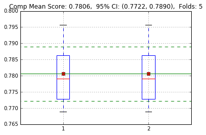


       colsample_bylevel     gamma      lambda  max_depth  min_child_weight
    0            0.05411  0.002601  394.391123        2.0          37.29148
    Score: 0.7875
    Time: 159.03 seconds
    Score: 0.8023
    Time: 197.84 seconds
    Score: 0.7735
    Time: 165.98 seconds
    Score: 0.7803
    Time: 160.58 seconds
    Score: 0.7679
    Time: 155.20 seconds
    Score: 0.7875
    Score: 0.8023
    Score: 0.7735
    Score: 0.7803
    Score: 0.7679
    Score: 0.7875
    Score: 0.8023
    Score: 0.7735
    Score: 0.7803
    Score: 0.7679


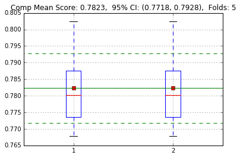


       colsample_bylevel     gamma     lambda  max_depth  min_child_weight
    0              0.108  0.103667  75.388268        4.0          0.983615
    Score: 0.7873
    Time: 78.25 seconds
    Score: 0.7978
    Time: 93.50 seconds
    Score: 0.7727
    Time: 68.59 seconds
    Score: 0.7787
    Time: 73.84 seconds
    Score: 0.7694
    Time: 56.74 seconds
    Score: 0.7873
    Score: 0.7978
    Score: 0.7727
    Score: 0.7787
    Score: 0.7694
    Score: 0.7873
    Score: 0.7978
    Score: 0.7727
    Score: 0.7787
    Score: 0.7694


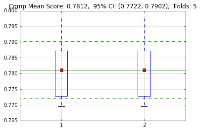


       colsample_bylevel     gamma      lambda  max_depth  min_child_weight
    0           0.062041  2.815963  119.438209        4.0          0.320332
    Score: 0.7858
    Time: 94.08 seconds
    Score: 0.8012
    Time: 80.70 seconds
    Score: 0.7759
    Time: 71.71 seconds
    Score: 0.7810
    Time: 93.83 seconds
    Score: 0.7707
    Time: 93.64 seconds
    Score: 0.7858
    Score: 0.8012
    Score: 0.7759
    Score: 0.7810
    Score: 0.7707
    Score: 0.7858
    Score: 0.8012
    Score: 0.7759
    Score: 0.7810
    Score: 0.7707


       colsample_bylevel     gamma    lambda  max_depth  min_child_weight
    0           0.103638  0.005734  9.649955        4.0          6.631517
    Score: 0.7829
    Time: 75.80 seconds
    Score: 0.7964
    Time: 90.46 seconds
    Score: 0.7720
    Time: 53.17 seconds
    Score: 0.7782
    Time: 62.85 seconds
    Score: 0.7707
    Time: 48.23 seconds
    Score: 0.7829
    Score: 0.7964
    Score: 0.7720
    Score: 0.7782
    Score: 0.7707
    Score: 0.7829
    Score: 0.7964
    Score: 0.7720
    Score: 0.7782
    Score: 0.7707


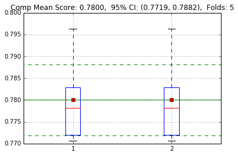


       colsample_bylevel     gamma    lambda  max_depth  min_child_weight
    0           0.103523  0.003093  6.275718        4.0          8.628248
    Score: 0.7847
    Time: 75.67 seconds
    Score: 0.7987
    Time: 58.73 seconds
    Score: 0.7713
    Time: 53.58 seconds
    Score: 0.7779
    Time: 54.63 seconds
    Score: 0.7664
    Time: 54.16 seconds
    Score: 0.7847
    Score: 0.7987
    Score: 0.7713
    Score: 0.7779
    Score: 0.7664
    Score: 0.7847
    Score: 0.7987
    Score: 0.7713
    Score: 0.7779
    Score: 0.7664


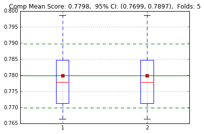


       colsample_bylevel     gamma     lambda  max_depth  min_child_weight
    0           0.121014  0.008721  27.970595        4.0          4.887325
    Score: 0.7877
    Time: 84.71 seconds
    Score: 0.7996
    Time: 81.38 seconds
    Score: 0.7762
    Time: 64.85 seconds
    Score: 0.7793
    Time: 80.12 seconds
    Score: 0.7694
    Time: 58.04 seconds
    Score: 0.7877
    Score: 0.7996
    Score: 0.7762
    Score: 0.7793
    Score: 0.7694
    Score: 0.7877
    Score: 0.7996
    Score: 0.7762
    Score: 0.7793
    Score: 0.7694


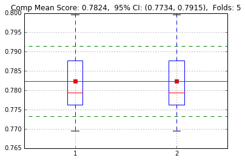


       colsample_bylevel    gamma    lambda  max_depth  min_child_weight
    0           0.086997  0.12068  3.170096        3.0          3.656034
    Score: 0.7858
    Time: 76.91 seconds
    Score: 0.8007
    Time: 87.11 seconds
    Score: 0.7717
    Time: 49.78 seconds
    Score: 0.7789
    Time: 76.20 seconds
    Score: 0.7695
    Time: 53.17 seconds
    Score: 0.7858
    Score: 0.8007
    Score: 0.7717
    Score: 0.7789
    Score: 0.7695
    Score: 0.7858
    Score: 0.8007
    Score: 0.7717
    Score: 0.7789
    Score: 0.7695


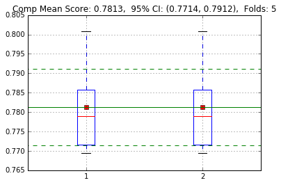


       colsample_bylevel     gamma     lambda  max_depth  min_child_weight
    0           0.136027  1.481315  27.053301        4.0          0.652312
    Score: 0.7862
    Time: 91.25 seconds
    Score: 0.8006
    Time: 84.82 seconds
    Score: 0.7748
    Time: 70.28 seconds
    Score: 0.7795
    Time: 71.60 seconds
    Score: 0.7717
    Time: 65.75 seconds
    Score: 0.7862
    Score: 0.8006
    Score: 0.7748
    Score: 0.7795
    Score: 0.7717
    Score: 0.7862
    Score: 0.8006
    Score: 0.7748
    Score: 0.7795
    Score: 0.7717


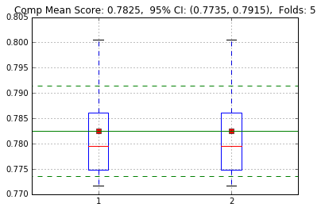


       colsample_bylevel     gamma     lambda  max_depth  min_child_weight
    0           0.059903  2.676418  284.85398        2.0          0.176539
    Score: 0.7837
    Time: 283.56 seconds
    Score: 0.7956
    Time: 167.38 seconds
    Score: 0.7716
    Time: 162.88 seconds
    Score: 0.7780
    Time: 157.65 seconds
    Score: 0.7640
    Time: 170.45 seconds
    Score: 0.7837
    Score: 0.7956
    Score: 0.7716
    Score: 0.7780
    Score: 0.7640
    Score: 0.7837
    Score: 0.7956
    Score: 0.7716
    Score: 0.7780
    Score: 0.7640


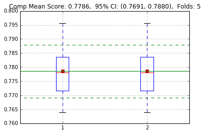


       colsample_bylevel     gamma     lambda  max_depth  min_child_weight
    0           0.122874  0.782896  53.059224        3.0           0.80767
    Score: 0.7882
    Time: 99.21 seconds
    Score: 0.8012
    Time: 130.87 seconds
    Score: 0.7749
    Time: 75.28 seconds
    Score: 0.7813
    Time: 91.13 seconds
    Score: 0.7700
    Time: 68.41 seconds
    Score: 0.7882
    Score: 0.8012
    Score: 0.7749
    Score: 0.7813
    Score: 0.7700
    Score: 0.7882
    Score: 0.8012
    Score: 0.7749
    Score: 0.7813
    Score: 0.7700


       colsample_bylevel    gamma      lambda  max_depth  min_child_weight
    0             0.0584  6.55951  116.272894        4.0         19.999858
    Score: 0.7861
    Time: 184.56 seconds
    Score: 0.7979
    Time: 179.26 seconds
    Score: 0.7752
    Time: 154.27 seconds
    Score: 0.7792
    Time: 142.88 seconds
    Score: 0.7665
    Time: 114.21 seconds
    Score: 0.7861
    Score: 0.7979
    Score: 0.7752
    Score: 0.7792
    Score: 0.7665
    Score: 0.7861
    Score: 0.7979
    Score: 0.7752
    Score: 0.7792
    Score: 0.7665


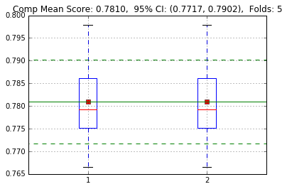


       colsample_bylevel     gamma    lambda  max_depth  min_child_weight
    0            0.11273  1.196045  2.400008        4.0         16.976268
    Score: 0.7830
    Time: 59.06 seconds
    Score: 0.7969
    Time: 98.08 seconds
    Score: 0.7745
    Time: 49.36 seconds
    Score: 0.7782
    Time: 59.23 seconds
    Score: 0.7675
    Time: 40.04 seconds
    Score: 0.7830
    Score: 0.7969
    Score: 0.7745
    Score: 0.7782
    Score: 0.7675
    Score: 0.7830
    Score: 0.7969
    Score: 0.7745
    Score: 0.7782
    Score: 0.7675


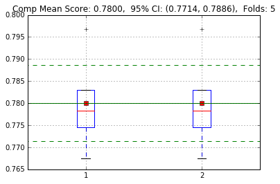


       colsample_bylevel     gamma    lambda  max_depth  min_child_weight
    0           0.055573  2.954674  1.654055        2.0         18.316502
    Score: 0.7860
    Time: 161.80 seconds
    Score: 0.7999
    Time: 139.83 seconds
    Score: 0.7722
    Time: 66.62 seconds
    Score: 0.7787
    Time: 96.65 seconds
    Score: 0.7690
    Time: 88.52 seconds
    Score: 0.7860
    Score: 0.7999
    Score: 0.7722
    Score: 0.7787
    Score: 0.7690
    Score: 0.7860
    Score: 0.7999
    Score: 0.7722
    Score: 0.7787
    Score: 0.7690


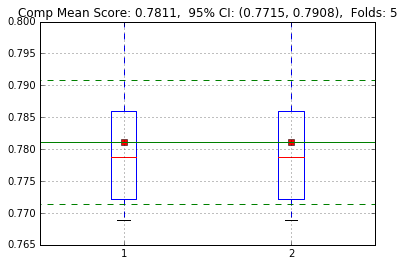


       colsample_bylevel     gamma      lambda  max_depth  min_child_weight
    0           0.072342  0.025001  152.850175        4.0         25.730014
    Score: 0.7895
    Time: 120.33 seconds
    Score: 0.8032
    Time: 117.20 seconds
    Score: 0.7743
    Time: 85.28 seconds
    Score: 0.7809
    Time: 84.19 seconds
    Score: 0.7704
    Time: 80.84 seconds
    Score: 0.7895
    Score: 0.8032
    Score: 0.7743
    Score: 0.7809
    Score: 0.7704
    Score: 0.7895
    Score: 0.8032
    Score: 0.7743
    Score: 0.7809
    Score: 0.7704


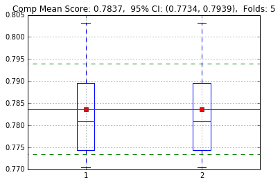


       colsample_bylevel    gamma    lambda  max_depth  min_child_weight
    0           0.053388  0.00616  3.133251        4.0          2.015256
    Score: 0.7830
    Time: 51.77 seconds
    Score: 0.8001
    Time: 83.49 seconds
    Score: 0.7695
    Time: 48.55 seconds
    Score: 0.7812
    Time: 74.30 seconds
    Score: 0.7687
    Time: 53.59 seconds
    Score: 0.7830
    Score: 0.8001
    Score: 0.7695
    Score: 0.7812
    Score: 0.7687
    Score: 0.7830
    Score: 0.8001
    Score: 0.7695
    Score: 0.7812
    Score: 0.7687


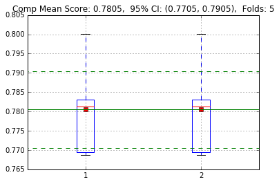


       colsample_bylevel     gamma    lambda  max_depth  min_child_weight
    0           0.117038  0.007919  7.421553        4.0          4.159425
    Score: 0.7841
    Time: 75.52 seconds
    Score: 0.8000
    Time: 77.83 seconds
    Score: 0.7721
    Time: 56.68 seconds
    Score: 0.7797
    Time: 61.42 seconds
    Score: 0.7691
    Time: 68.25 seconds
    Score: 0.7841
    Score: 0.8000
    Score: 0.7721
    Score: 0.7797
    Score: 0.7691
    Score: 0.7841
    Score: 0.8000
    Score: 0.7721
    Score: 0.7797
    Score: 0.7691


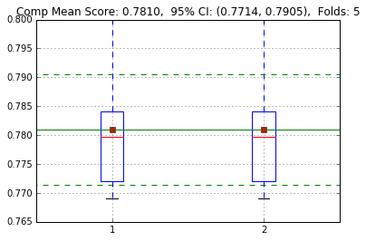


       colsample_bylevel     gamma    lambda  max_depth  min_child_weight
    0           0.126068  0.014513  1.223254        4.0          0.149984
    Score: 0.7841
    Time: 66.29 seconds
    Score: 0.7977
    Time: 59.25 seconds
    Score: 0.7697
    Time: 44.77 seconds
    Score: 0.7729
    Time: 55.64 seconds
    Score: 0.7673
    Time: 52.14 seconds
    Score: 0.7841
    Score: 0.7977
    Score: 0.7697
    Score: 0.7729
    Score: 0.7673
    Score: 0.7841
    Score: 0.7977
    Score: 0.7697
    Score: 0.7729
    Score: 0.7673


       colsample_bylevel     gamma     lambda  max_depth  min_child_weight
    0           0.066398  6.441836  64.979154        3.0         24.571331
    Score: 0.7832
    Time: 86.72 seconds
    Score: 0.7966
    Time: 135.13 seconds
    Score: 0.7741
    Time: 121.37 seconds
    Score: 0.7794
    Time: 169.59 seconds
    Score: 0.7665
    Time: 127.90 seconds
    Score: 0.7832
    Score: 0.7966
    Score: 0.7741
    Score: 0.7794
    Score: 0.7665
    Score: 0.7832
    Score: 0.7966
    Score: 0.7741
    Score: 0.7794
    Score: 0.7665


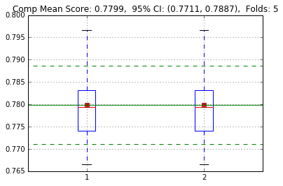


       colsample_bylevel     gamma    lambda  max_depth  min_child_weight
    0           0.059174  2.841783  2.733476        4.0          0.351166
    Score: 0.7835
    Time: 43.56 seconds
    Score: 0.7960
    Time: 67.81 seconds
    Score: 0.7706
    Time: 42.35 seconds
    Score: 0.7779
    Time: 44.66 seconds
    Score: 0.7685
    Time: 38.65 seconds
    Score: 0.7835
    Score: 0.7960
    Score: 0.7706
    Score: 0.7779
    Score: 0.7685
    Score: 0.7835
    Score: 0.7960
    Score: 0.7706
    Score: 0.7779
    Score: 0.7685


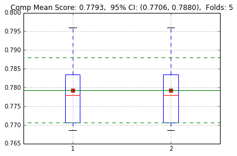


       colsample_bylevel    gamma      lambda  max_depth  min_child_weight
    0           0.081782  0.37786  218.150352        3.0          2.177725
    Score: 0.7859
    Time: 110.83 seconds
    Score: 0.8024
    Time: 130.54 seconds
    Score: 0.7762
    Time: 81.85 seconds
    Score: 0.7799
    Time: 89.65 seconds
    Score: 0.7693
    Time: 83.10 seconds
    Score: 0.7859
    Score: 0.8024
    Score: 0.7762
    Score: 0.7799
    Score: 0.7693
    Score: 0.7859
    Score: 0.8024
    Score: 0.7762
    Score: 0.7799
    Score: 0.7693


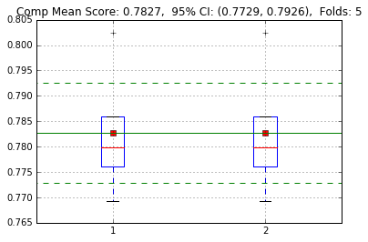


       colsample_bylevel     gamma     lambda  max_depth  min_child_weight
    0           0.146283  0.023728  46.961479        3.0          1.055752
    Score: 0.7871
    Time: 102.65 seconds
    Score: 0.8003
    Time: 105.85 seconds
    Score: 0.7744
    Time: 65.03 seconds
    Score: 0.7811
    Time: 92.79 seconds
    Score: 0.7721
    Time: 65.11 seconds
    Score: 0.7871
    Score: 0.8003
    Score: 0.7744
    Score: 0.7811
    Score: 0.7721
    Score: 0.7871
    Score: 0.8003
    Score: 0.7744
    Score: 0.7811
    Score: 0.7721


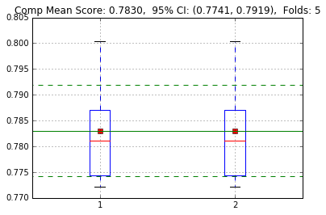


       colsample_bylevel     gamma     lambda  max_depth  min_child_weight
    0           0.042415  0.041511  15.241821        3.0         11.243902
    Score: 0.7865
    Time: 59.91 seconds
    Score: 0.8009
    Time: 72.29 seconds
    Score: 0.7712
    Time: 44.01 seconds
    Score: 0.7810
    Time: 64.87 seconds
    Score: 0.7716
    Time: 57.21 seconds
    Score: 0.7865
    Score: 0.8009
    Score: 0.7712
    Score: 0.7810
    Score: 0.7716
    Score: 0.7865
    Score: 0.8009
    Score: 0.7712
    Score: 0.7810
    Score: 0.7716


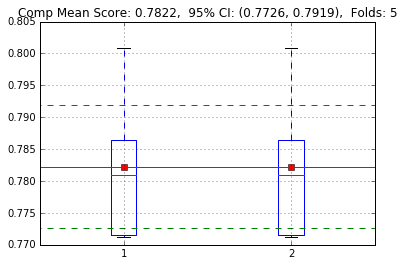


       colsample_bylevel     gamma      lambda  max_depth  min_child_weight
    0            0.07396  0.478429  178.601985        2.0          1.262995
    Score: 0.7888
    Time: 151.37 seconds
    Score: 0.8035
    Time: 169.20 seconds
    Score: 0.7728
    Time: 81.98 seconds
    Score: 0.7805
    Time: 108.24 seconds
    Score: 0.7678
    Time: 98.21 seconds
    Score: 0.7888
    Score: 0.8035
    Score: 0.7728
    Score: 0.7805
    Score: 0.7678
    Score: 0.7888
    Score: 0.8035
    Score: 0.7728
    Score: 0.7805
    Score: 0.7678


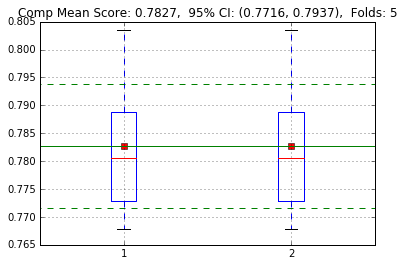


       colsample_bylevel     gamma     lambda  max_depth  min_child_weight
    0           0.090157  0.292144  45.546531        3.0          0.517258
    Score: 0.7875
    Time: 92.46 seconds
    Score: 0.8022
    Time: 93.64 seconds
    Score: 0.7746
    Time: 75.91 seconds
    Score: 0.7807
    Time: 79.61 seconds
    Score: 0.7714
    Time: 56.56 seconds
    Score: 0.7875
    Score: 0.8022
    Score: 0.7746
    Score: 0.7807
    Score: 0.7714
    Score: 0.7875
    Score: 0.8022
    Score: 0.7746
    Score: 0.7807
    Score: 0.7714


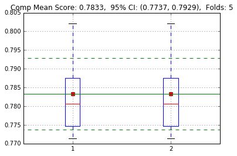


       colsample_bylevel     gamma      lambda  max_depth  min_child_weight
    0           0.087899  0.051213  122.864554        3.0          0.463737
    Score: 0.7871
    Time: 89.97 seconds
    Score: 0.8021
    Time: 118.49 seconds
    Score: 0.7746
    Time: 71.60 seconds
    Score: 0.7812
    Time: 69.81 seconds
    Score: 0.7706
    Time: 74.21 seconds
    Score: 0.7871
    Score: 0.8021
    Score: 0.7746
    Score: 0.7812
    Score: 0.7706
    Score: 0.7871
    Score: 0.8021
    Score: 0.7746
    Score: 0.7812
    Score: 0.7706


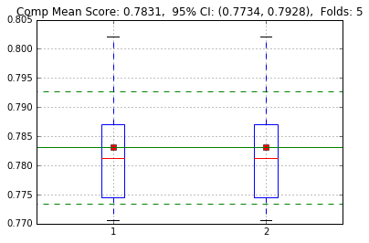


       colsample_bylevel    gamma     lambda  max_depth  min_child_weight
    0           0.071358  0.20745  35.745627        2.0          1.586639
    Score: 0.7877
    Time: 129.87 seconds
    Score: 0.8029
    Time: 149.66 seconds
    Score: 0.7730
    Time: 81.58 seconds
    Score: 0.7806
    Time: 103.01 seconds
    Score: 0.7698
    Time: 78.14 seconds
    Score: 0.7877
    Score: 0.8029
    Score: 0.7730
    Score: 0.7806
    Score: 0.7698
    Score: 0.7877
    Score: 0.8029
    Score: 0.7730
    Score: 0.7806
    Score: 0.7698


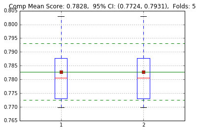


       colsample_bylevel     gamma     lambda  max_depth  min_child_weight
    0           0.041898  0.031186  17.014364        3.0          0.214541
    Score: 0.7869
    Time: 71.66 seconds
    Score: 0.8029
    Time: 85.67 seconds
    Score: 0.7731
    Time: 52.50 seconds
    Score: 0.7792
    Time: 53.06 seconds
    Score: 0.7701
    Time: 43.86 seconds
    Score: 0.7869
    Score: 0.8029
    Score: 0.7731
    Score: 0.7792
    Score: 0.7701
    Score: 0.7869
    Score: 0.8029
    Score: 0.7731
    Score: 0.7792
    Score: 0.7701


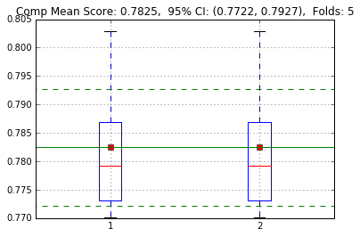


       colsample_bylevel     gamma      lambda  max_depth  min_child_weight
    0           0.094337  0.061709  399.313684        3.0         45.755995
    Score: 0.7875
    Time: 128.80 seconds
    Score: 0.8006
    Time: 147.85 seconds
    Score: 0.7728
    Time: 81.24 seconds
    Score: 0.7792
    Time: 105.38 seconds
    Score: 0.7670
    Time: 89.95 seconds
    Score: 0.7875
    Score: 0.8006
    Score: 0.7728
    Score: 0.7792
    Score: 0.7670
    Score: 0.7875
    Score: 0.8006
    Score: 0.7728
    Score: 0.7792
    Score: 0.7670


       colsample_bylevel     gamma     lambda  max_depth  min_child_weight
    0           0.079391  0.284368  83.187169        2.0          0.537734
    Score: 0.7880
    Time: 130.80 seconds
    Score: 0.8037
    Time: 158.08 seconds
    Score: 0.7744
    Time: 95.33 seconds
    Score: 0.7806
    Time: 88.02 seconds
    Score: 0.7685
    Time: 81.81 seconds
    Score: 0.7880
    Score: 0.8037
    Score: 0.7744
    Score: 0.7806
    Score: 0.7685
    Score: 0.7880
    Score: 0.8037
    Score: 0.7744
    Score: 0.7806
    Score: 0.7685


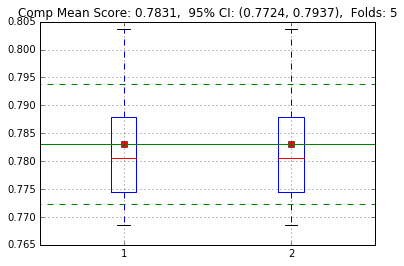


       colsample_bylevel     gamma     lambda  max_depth  min_child_weight
    0           0.098315  0.094058  186.21266        3.0          2.901279
    Score: 0.7888
    Time: 105.25 seconds
    Score: 0.8032
    Time: 117.54 seconds
    Score: 0.7759
    Time: 88.19 seconds
    Score: 0.7821
    Time: 104.83 seconds
    Score: 0.7690
    Time: 83.60 seconds
    Score: 0.7888
    Score: 0.8032
    Score: 0.7759
    Score: 0.7821
    Score: 0.7690
    Score: 0.7888
    Score: 0.8032
    Score: 0.7759
    Score: 0.7821
    Score: 0.7690


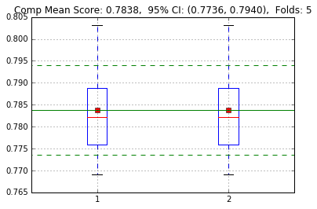


       colsample_bylevel     gamma      lambda  max_depth  min_child_weight
    0           0.096808  0.070813  272.806559        2.0         51.585159
    Score: 0.7865
    Time: 173.37 seconds
    Score: 0.8022
    Time: 198.34 seconds
    Score: 0.7727
    Time: 116.82 seconds
    Score: 0.7803
    Time: 136.30 seconds
    Score: 0.7684
    Time: 121.23 seconds
    Score: 0.7865
    Score: 0.8022
    Score: 0.7727
    Score: 0.7803
    Score: 0.7684
    Score: 0.7865
    Score: 0.8022
    Score: 0.7727
    Score: 0.7803
    Score: 0.7684


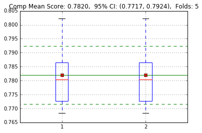


       colsample_bylevel     gamma      lambda  max_depth  min_child_weight
    0           0.097941  0.016033  159.961967        3.0         31.290382
    Score: 0.7896
    Time: 110.97 seconds
    Score: 0.8044
    Time: 136.29 seconds
    Score: 0.7742
    Time: 65.79 seconds
    Score: 0.7805
    Time: 83.05 seconds
    Score: 0.7710
    Time: 78.77 seconds
    Score: 0.7896
    Score: 0.8044
    Score: 0.7742
    Score: 0.7805
    Score: 0.7710
    Score: 0.7896
    Score: 0.8044
    Score: 0.7742
    Score: 0.7805
    Score: 0.7710


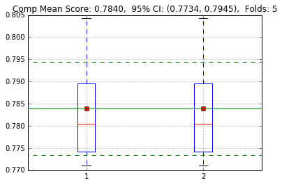


       colsample_bylevel     gamma      lambda  max_depth  min_child_weight
    0            0.13111  0.012193  347.392483        3.0         11.338068
    Score: 0.7887
    Time: 130.25 seconds
    Score: 0.8042
    Time: 185.11 seconds
    Score: 0.7743
    Time: 96.49 seconds
    Score: 0.7810
    Time: 136.51 seconds
    Score: 0.7706
    Time: 131.27 seconds
    Score: 0.7887
    Score: 0.8042
    Score: 0.7743
    Score: 0.7810
    Score: 0.7706
    Score: 0.7887
    Score: 0.8042
    Score: 0.7743
    Score: 0.7810
    Score: 0.7706


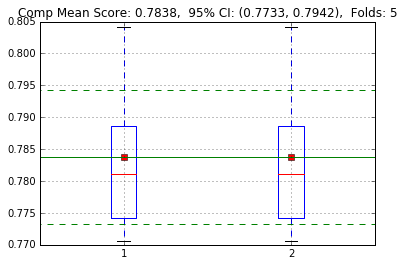


       colsample_bylevel     gamma     lambda  max_depth  min_child_weight
    0           0.109278  0.002671  80.039129        3.0         34.416378
    Score: 0.7883
    Time: 91.15 seconds
    Score: 0.8026
    Time: 126.81 seconds
    Score: 0.7747
    Time: 73.69 seconds
    Score: 0.7804
    Time: 89.77 seconds
    Score: 0.7707
    Time: 72.84 seconds
    Score: 0.7883
    Score: 0.8026
    Score: 0.7747
    Score: 0.7804
    Score: 0.7707
    Score: 0.7883
    Score: 0.8026
    Score: 0.7747
    Score: 0.7804
    Score: 0.7707


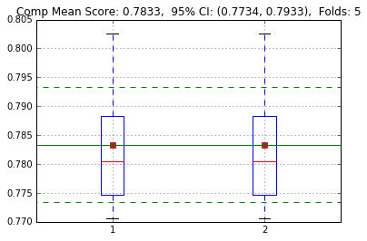


       colsample_bylevel     gamma      lambda  max_depth  min_child_weight
    0           0.097794  0.084481  216.673046        2.0          5.728526
    Score: 0.7878
    Time: 170.02 seconds
    Score: 0.8026
    Time: 198.97 seconds
    Score: 0.7748
    Time: 143.73 seconds
    Score: 0.7808
    Time: 121.87 seconds
    Score: 0.7694
    Time: 132.42 seconds
    Score: 0.7878
    Score: 0.8026
    Score: 0.7748
    Score: 0.7808
    Score: 0.7694
    Score: 0.7878
    Score: 0.8026
    Score: 0.7748
    Score: 0.7808
    Score: 0.7694


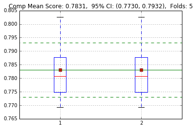


       colsample_bylevel     gamma     lambda  max_depth  min_child_weight
    0           0.102159  0.003582  12.542904        3.0          3.005051
    Score: 0.7867
    Time: 73.27 seconds
    Score: 0.8013
    Time: 93.10 seconds
    Score: 0.7743
    Time: 61.55 seconds
    Score: 0.7806
    Time: 75.10 seconds
    Score: 0.7719
    Time: 52.85 seconds
    Score: 0.7867
    Score: 0.8013
    Score: 0.7743
    Score: 0.7806
    Score: 0.7719
    Score: 0.7867
    Score: 0.8013
    Score: 0.7743
    Score: 0.7806
    Score: 0.7719


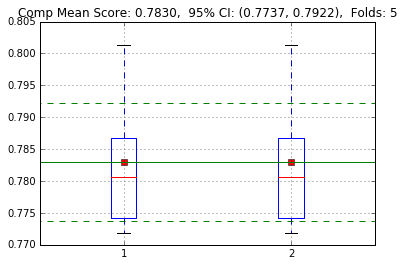


       colsample_bylevel     gamma     lambda  max_depth  min_child_weight
    0            0.14881  0.150535  97.386409        3.0          8.220372
    Score: 0.7885
    Time: 97.55 seconds
    Score: 0.8027
    Time: 138.12 seconds
    Score: 0.7759
    Time: 87.13 seconds
    Score: 0.7819
    Time: 91.39 seconds
    Score: 0.7691
    Time: 77.94 seconds
    Score: 0.7885
    Score: 0.8027
    Score: 0.7759
    Score: 0.7819
    Score: 0.7691
    Score: 0.7885
    Score: 0.8027
    Score: 0.7759
    Score: 0.7819
    Score: 0.7691


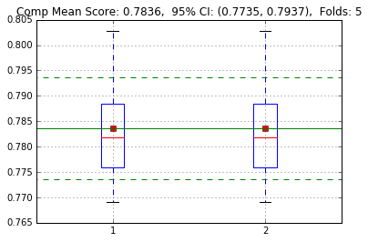


       colsample_bylevel     gamma    lambda  max_depth  min_child_weight
    0           0.136821  0.155783  25.48591        2.0          2.925309
    Score: 0.7859
    Time: 95.37 seconds
    Score: 0.8027
    Time: 120.59 seconds
    Score: 0.7730
    Time: 90.64 seconds
    Score: 0.7804
    Time: 92.44 seconds
    Score: 0.7704
    Time: 78.11 seconds
    Score: 0.7859
    Score: 0.8027
    Score: 0.7730
    Score: 0.7804
    Score: 0.7704
    Score: 0.7859
    Score: 0.8027
    Score: 0.7730
    Score: 0.7804
    Score: 0.7704


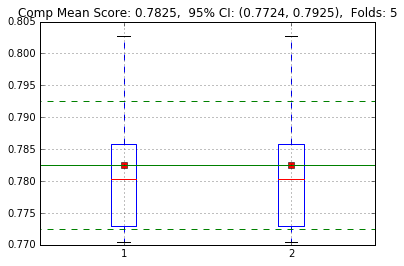


       colsample_bylevel     gamma    lambda  max_depth  min_child_weight
    0           0.115023  0.013079  4.440365        3.0         13.077846
    Score: 0.7869
    Time: 70.60 seconds
    Score: 0.8010
    Time: 101.97 seconds
    Score: 0.7734
    Time: 53.50 seconds
    Score: 0.7785
    Time: 75.15 seconds
    Score: 0.7708
    Time: 52.55 seconds
    Score: 0.7869
    Score: 0.8010
    Score: 0.7734
    Score: 0.7785
    Score: 0.7708
    Score: 0.7869
    Score: 0.8010
    Score: 0.7734
    Score: 0.7785
    Score: 0.7708


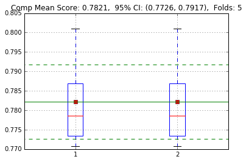


       colsample_bylevel     gamma      lambda  max_depth  min_child_weight
    0           0.107469  0.004267  392.485514        3.0          6.765868
    Score: 0.7873
    Time: 161.51 seconds
    Score: 0.8042
    Time: 161.31 seconds
    Score: 0.7755
    Time: 112.35 seconds
    Score: 0.7828
    Time: 108.22 seconds
    Score: 0.7691
    Time: 101.72 seconds
    Score: 0.7873
    Score: 0.8042
    Score: 0.7755
    Score: 0.7828
    Score: 0.7691
    Score: 0.7873
    Score: 0.8042
    Score: 0.7755
    Score: 0.7828
    Score: 0.7691


       colsample_bylevel     gamma      lambda  max_depth  min_child_weight
    0           0.142599  0.687548  138.877782        2.0         44.183643
    Score: 0.7853
    Time: 142.40 seconds
    Score: 0.8029
    Time: 179.19 seconds
    Score: 0.7732
    Time: 112.71 seconds
    Score: 0.7798
    Time: 144.33 seconds
    Score: 0.7678
    Time: 115.84 seconds
    Score: 0.7853
    Score: 0.8029
    Score: 0.7732
    Score: 0.7798
    Score: 0.7678
    Score: 0.7853
    Score: 0.8029
    Score: 0.7732
    Score: 0.7798
    Score: 0.7678


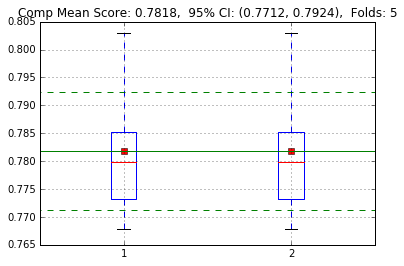


       colsample_bylevel     gamma      lambda  max_depth  min_child_weight
    0           0.081449  0.107031  289.316956        3.0         27.426817
    Score: 0.7891
    Time: 113.88 seconds
    Score: 0.8023
    Time: 124.89 seconds
    Score: 0.7760
    Time: 102.14 seconds
    Score: 0.7812
    Time: 114.00 seconds
    Score: 0.7691
    Time: 63.97 seconds
    Score: 0.7891
    Score: 0.8023
    Score: 0.7760
    Score: 0.7812
    Score: 0.7691
    Score: 0.7891
    Score: 0.8023
    Score: 0.7760
    Score: 0.7812
    Score: 0.7691


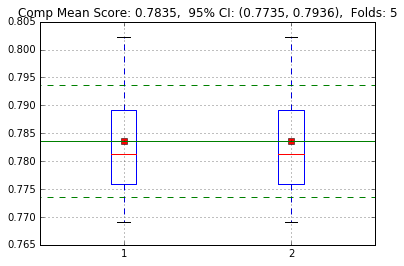


       colsample_bylevel     gamma     lambda  max_depth  min_child_weight
    0            0.10075  0.020036  60.099716        3.0          3.745635
    Score: 0.7870
    Time: 91.18 seconds
    Score: 0.8031
    Time: 115.82 seconds
    Score: 0.7748
    Time: 55.02 seconds
    Score: 0.7804
    Time: 96.86 seconds
    Score: 0.7716
    Time: 71.19 seconds
    Score: 0.7870
    Score: 0.8031
    Score: 0.7748
    Score: 0.7804
    Score: 0.7716
    Score: 0.7870
    Score: 0.8031
    Score: 0.7748
    Score: 0.7804
    Score: 0.7716


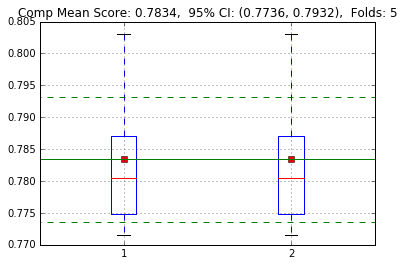


       colsample_bylevel     gamma     lambda  max_depth  min_child_weight
    0           0.090886  0.034705  32.874282        4.0          0.254445
    Score: 0.7863
    Time: 54.24 seconds
    Score: 0.7999
    Time: 64.47 seconds
    Score: 0.7743
    Time: 55.22 seconds
    Score: 0.7800
    Time: 58.81 seconds
    Score: 0.7688
    Time: 41.13 seconds
    Score: 0.7863
    Score: 0.7999
    Score: 0.7743
    Score: 0.7800
    Score: 0.7688
    Score: 0.7863
    Score: 0.7999
    Score: 0.7743
    Score: 0.7800
    Score: 0.7688


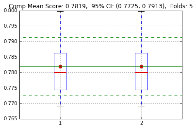


       colsample_bylevel     gamma      lambda  max_depth  min_child_weight
    0           0.049405  0.017442  180.804296        2.0          0.725351
    Score: 0.7874
    Time: 147.08 seconds
    Score: 0.8024
    Time: 146.75 seconds
    Score: 0.7746
    Time: 127.58 seconds
    Score: 0.7798
    Time: 101.57 seconds
    Score: 0.7680
    Time: 90.62 seconds
    Score: 0.7874
    Score: 0.8024
    Score: 0.7746
    Score: 0.7798
    Score: 0.7680
    Score: 0.7874
    Score: 0.8024
    Score: 0.7746
    Score: 0.7798
    Score: 0.7680


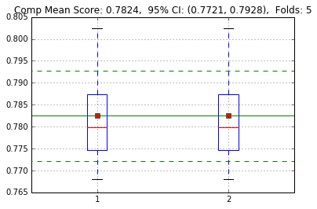


       colsample_bylevel     gamma     lambda  max_depth  min_child_weight
    0           0.120984  0.005762  96.764749        4.0          1.652537
    Score: 0.7875
    Time: 88.93 seconds
    Score: 0.8005
    Time: 108.13 seconds
    Score: 0.7760
    Time: 66.92 seconds
    Score: 0.7815
    Time: 93.44 seconds
    Score: 0.7690
    Time: 62.73 seconds
    Score: 0.7875
    Score: 0.8005
    Score: 0.7760
    Score: 0.7815
    Score: 0.7690
    Score: 0.7875
    Score: 0.8005
    Score: 0.7760
    Score: 0.7815
    Score: 0.7690


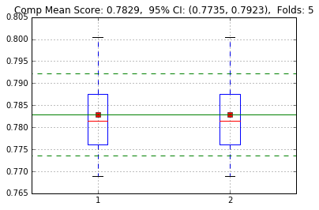


       colsample_bylevel     gamma     lambda  max_depth  min_child_weight
    0           0.065965  0.009333  20.274372        3.0          14.24295
    Score: 0.7886
    Time: 117.02 seconds
    Score: 0.8007
    Time: 124.48 seconds
    Score: 0.7734
    Time: 60.29 seconds
    Score: 0.7808
    Time: 84.91 seconds
    Score: 0.7677
    Time: 64.96 seconds
    Score: 0.7886
    Score: 0.8007
    Score: 0.7734
    Score: 0.7808
    Score: 0.7677
    Score: 0.7886
    Score: 0.8007
    Score: 0.7734
    Score: 0.7808
    Score: 0.7677


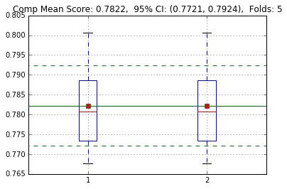


       colsample_bylevel     gamma    lambda  max_depth  min_child_weight
    0           0.110601  1.707333  10.47743        4.0          5.262636
    Score: 0.7832
    Time: 78.70 seconds
    Score: 0.8012
    Time: 71.93 seconds
    Score: 0.7741
    Time: 78.46 seconds
    Score: 0.7779
    Time: 86.63 seconds
    Score: 0.7689
    Time: 59.79 seconds
    Score: 0.7832
    Score: 0.8012
    Score: 0.7741
    Score: 0.7779
    Score: 0.7689
    Score: 0.7832
    Score: 0.8012
    Score: 0.7741
    Score: 0.7779
    Score: 0.7689


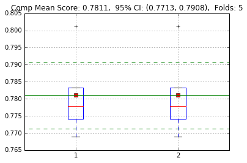


       colsample_bylevel     gamma   lambda  max_depth  min_child_weight
    0           0.129327  0.049662  6.09799        2.0          8.611968
    Score: 0.7869
    Time: 107.90 seconds
    Score: 0.8006
    Time: 127.94 seconds
    Score: 0.7725
    Time: 109.16 seconds
    Score: 0.7809
    Time: 134.55 seconds
    Score: 0.7690
    Time: 78.83 seconds
    Score: 0.7869
    Score: 0.8006
    Score: 0.7725
    Score: 0.7809
    Score: 0.7690
    Score: 0.7869
    Score: 0.8006
    Score: 0.7725
    Score: 0.7809
    Score: 0.7690


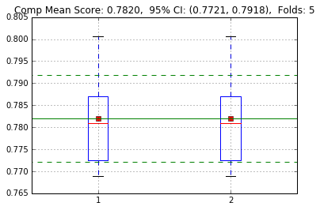


<div>
<table border="1" class="dataframe">
  <thead>
    <tr style="text-align: right;">
      <th></th>
      <th>min_child_weight</th>
      <th>max_depth</th>
      <th>lambda</th>
      <th>gamma</th>
      <th>colsample_bylevel</th>
      <th>loss</th>
    </tr>
  </thead>
  <tbody>
    <tr>
      <th>32</th>
      <td>31.290382</td>
      <td>3.0</td>
      <td>159.961967</td>
      <td>0.016033</td>
      <td>0.097941</td>
      <td>-0.783951</td>
    </tr>
    <tr>
      <th>30</th>
      <td>2.901279</td>
      <td>3.0</td>
      <td>186.212660</td>
      <td>0.094058</td>
      <td>0.098315</td>
      <td>-0.783803</td>
    </tr>
    <tr>
      <th>40</th>
      <td>6.765868</td>
      <td>3.0</td>
      <td>392.485514</td>
      <td>0.004267</td>
      <td>0.107469</td>
      <td>-0.783784</td>
    </tr>
    <tr>
      <th>33</th>
      <td>11.338068</td>
      <td>3.0</td>
      <td>347.392483</td>
      <td>0.012193</td>
      <td>0.131110</td>
      <td>-0.783757</td>
    </tr>
    <tr>
      <th>14</th>
      <td>25.730014</td>
      <td>4.0</td>
      <td>152.850175</td>
      <td>0.025001</td>
      <td>0.072342</td>
      <td>-0.783651</td>
    </tr>
    <tr>
      <th>37</th>
      <td>8.220372</td>
      <td>3.0</td>
      <td>97.386409</td>
      <td>0.150535</td>
      <td>0.148810</td>
      <td>-0.783614</td>
    </tr>
    <tr>
      <th>42</th>
      <td>27.426817</td>
      <td>3.0</td>
      <td>289.316956</td>
      <td>0.107031</td>
      <td>0.081449</td>
      <td>-0.783538</td>
    </tr>
    <tr>
      <th>43</th>
      <td>3.745635</td>
      <td>3.0</td>
      <td>60.099716</td>
      <td>0.020036</td>
      <td>0.100750</td>
      <td>-0.783379</td>
    </tr>
    <tr>
      <th>34</th>
      <td>34.416378</td>
      <td>3.0</td>
      <td>80.039129</td>
      <td>0.002671</td>
      <td>0.109278</td>
      <td>-0.783345</td>
    </tr>
    <tr>
      <th>24</th>
      <td>0.517258</td>
      <td>3.0</td>
      <td>45.546531</td>
      <td>0.292144</td>
      <td>0.090157</td>
      <td>-0.783275</td>
    </tr>
    <tr>
      <th>25</th>
      <td>0.463737</td>
      <td>3.0</td>
      <td>122.864554</td>
      <td>0.051213</td>
      <td>0.087899</td>
      <td>-0.783103</td>
    </tr>
    <tr>
      <th>10</th>
      <td>0.807670</td>
      <td>3.0</td>
      <td>53.059224</td>
      <td>0.782896</td>
      <td>0.122874</td>
      <td>-0.783099</td>
    </tr>
    <tr>
      <th>29</th>
      <td>0.537734</td>
      <td>2.0</td>
      <td>83.187169</td>
      <td>0.284368</td>
      <td>0.079391</td>
      <td>-0.783060</td>
    </tr>
    <tr>
      <th>35</th>
      <td>5.728526</td>
      <td>2.0</td>
      <td>216.673046</td>
      <td>0.084481</td>
      <td>0.097794</td>
      <td>-0.783057</td>
    </tr>
    <tr>
      <th>21</th>
      <td>1.055752</td>
      <td>3.0</td>
      <td>46.961479</td>
      <td>0.023728</td>
      <td>0.146283</td>
      <td>-0.783008</td>
    </tr>
    <tr>
      <th>36</th>
      <td>3.005051</td>
      <td>3.0</td>
      <td>12.542904</td>
      <td>0.003582</td>
      <td>0.102159</td>
      <td>-0.782950</td>
    </tr>
    <tr>
      <th>3</th>
      <td>0.320332</td>
      <td>4.0</td>
      <td>119.438209</td>
      <td>2.815963</td>
      <td>0.062041</td>
      <td>-0.782928</td>
    </tr>
    <tr>
      <th>46</th>
      <td>1.652537</td>
      <td>4.0</td>
      <td>96.764749</td>
      <td>0.005762</td>
      <td>0.120984</td>
      <td>-0.782878</td>
    </tr>
    <tr>
      <th>26</th>
      <td>1.586639</td>
      <td>2.0</td>
      <td>35.745627</td>
      <td>0.207450</td>
      <td>0.071358</td>
      <td>-0.782790</td>
    </tr>
    <tr>
      <th>20</th>
      <td>2.177725</td>
      <td>3.0</td>
      <td>218.150352</td>
      <td>0.377860</td>
      <td>0.081782</td>
      <td>-0.782729</td>
    </tr>
    <tr>
      <th>23</th>
      <td>1.262995</td>
      <td>2.0</td>
      <td>178.601985</td>
      <td>0.478429</td>
      <td>0.073960</td>
      <td>-0.782674</td>
    </tr>
    <tr>
      <th>8</th>
      <td>0.652312</td>
      <td>4.0</td>
      <td>27.053301</td>
      <td>1.481315</td>
      <td>0.136027</td>
      <td>-0.782537</td>
    </tr>
    <tr>
      <th>38</th>
      <td>2.925309</td>
      <td>2.0</td>
      <td>25.485910</td>
      <td>0.155783</td>
      <td>0.136821</td>
      <td>-0.782473</td>
    </tr>
    <tr>
      <th>27</th>
      <td>0.214541</td>
      <td>3.0</td>
      <td>17.014364</td>
      <td>0.031186</td>
      <td>0.041898</td>
      <td>-0.782454</td>
    </tr>
    <tr>
      <th>45</th>
      <td>0.725351</td>
      <td>2.0</td>
      <td>180.804296</td>
      <td>0.017442</td>
      <td>0.049405</td>
      <td>-0.782442</td>
    </tr>
    <tr>
      <th>6</th>
      <td>4.887325</td>
      <td>4.0</td>
      <td>27.970595</td>
      <td>0.008721</td>
      <td>0.121014</td>
      <td>-0.782441</td>
    </tr>
    <tr>
      <th>1</th>
      <td>37.291480</td>
      <td>2.0</td>
      <td>394.391123</td>
      <td>0.002601</td>
      <td>0.054110</td>
      <td>-0.782297</td>
    </tr>
    <tr>
      <th>47</th>
      <td>14.242950</td>
      <td>3.0</td>
      <td>20.274372</td>
      <td>0.009333</td>
      <td>0.065965</td>
      <td>-0.782237</td>
    </tr>
    <tr>
      <th>22</th>
      <td>11.243902</td>
      <td>3.0</td>
      <td>15.241821</td>
      <td>0.041511</td>
      <td>0.042415</td>
      <td>-0.782232</td>
    </tr>
    <tr>
      <th>39</th>
      <td>13.077846</td>
      <td>3.0</td>
      <td>4.440365</td>
      <td>0.013079</td>
      <td>0.115023</td>
      <td>-0.782134</td>
    </tr>
    <tr>
      <th>31</th>
      <td>51.585159</td>
      <td>2.0</td>
      <td>272.806559</td>
      <td>0.070813</td>
      <td>0.096808</td>
      <td>-0.782029</td>
    </tr>
    <tr>
      <th>49</th>
      <td>8.611968</td>
      <td>2.0</td>
      <td>6.097990</td>
      <td>0.049662</td>
      <td>0.129327</td>
      <td>-0.781975</td>
    </tr>
    <tr>
      <th>44</th>
      <td>0.254445</td>
      <td>4.0</td>
      <td>32.874282</td>
      <td>0.034705</td>
      <td>0.090886</td>
      <td>-0.781875</td>
    </tr>
    <tr>
      <th>41</th>
      <td>44.183643</td>
      <td>2.0</td>
      <td>138.877782</td>
      <td>0.687548</td>
      <td>0.142599</td>
      <td>-0.781786</td>
    </tr>
    <tr>
      <th>28</th>
      <td>45.755995</td>
      <td>3.0</td>
      <td>399.313684</td>
      <td>0.061709</td>
      <td>0.094337</td>
      <td>-0.781401</td>
    </tr>
    <tr>
      <th>7</th>
      <td>3.656034</td>
      <td>3.0</td>
      <td>3.170096</td>
      <td>0.120680</td>
      <td>0.086997</td>
      <td>-0.781324</td>
    </tr>
    <tr>
      <th>2</th>
      <td>0.983615</td>
      <td>4.0</td>
      <td>75.388268</td>
      <td>0.103667</td>
      <td>0.108000</td>
      <td>-0.781191</td>
    </tr>
    <tr>
      <th>13</th>
      <td>18.316502</td>
      <td>2.0</td>
      <td>1.654055</td>
      <td>2.954674</td>
      <td>0.055573</td>
      <td>-0.781137</td>
    </tr>
    <tr>
      <th>48</th>
      <td>5.262636</td>
      <td>4.0</td>
      <td>10.477430</td>
      <td>1.707333</td>
      <td>0.110601</td>
      <td>-0.781058</td>
    </tr>
    <tr>
      <th>11</th>
      <td>19.999858</td>
      <td>4.0</td>
      <td>116.272894</td>
      <td>6.559510</td>
      <td>0.058400</td>
      <td>-0.780992</td>
    </tr>
    <tr>
      <th>16</th>
      <td>4.159425</td>
      <td>4.0</td>
      <td>7.421553</td>
      <td>0.007919</td>
      <td>0.117038</td>
      <td>-0.780977</td>
    </tr>
    <tr>
      <th>0</th>
      <td>34.273935</td>
      <td>4.0</td>
      <td>1.758499</td>
      <td>0.107672</td>
      <td>0.103231</td>
      <td>-0.780586</td>
    </tr>
    <tr>
      <th>15</th>
      <td>2.015256</td>
      <td>4.0</td>
      <td>3.133251</td>
      <td>0.006160</td>
      <td>0.053388</td>
      <td>-0.780490</td>
    </tr>
    <tr>
      <th>4</th>
      <td>6.631517</td>
      <td>4.0</td>
      <td>9.649955</td>
      <td>0.005734</td>
      <td>0.103638</td>
      <td>-0.780027</td>
    </tr>
    <tr>
      <th>12</th>
      <td>16.976268</td>
      <td>4.0</td>
      <td>2.400008</td>
      <td>1.196045</td>
      <td>0.112730</td>
      <td>-0.780008</td>
    </tr>
    <tr>
      <th>18</th>
      <td>24.571331</td>
      <td>3.0</td>
      <td>64.979154</td>
      <td>6.441836</td>
      <td>0.066398</td>
      <td>-0.779929</td>
    </tr>
    <tr>
      <th>5</th>
      <td>8.628248</td>
      <td>4.0</td>
      <td>6.275718</td>
      <td>0.003093</td>
      <td>0.103523</td>
      <td>-0.779797</td>
    </tr>
    <tr>
      <th>19</th>
      <td>0.351166</td>
      <td>4.0</td>
      <td>2.733476</td>
      <td>2.841783</td>
      <td>0.059174</td>
      <td>-0.779288</td>
    </tr>
    <tr>
      <th>9</th>
      <td>0.176539</td>
      <td>2.0</td>
      <td>284.853980</td>
      <td>2.676418</td>
      <td>0.059903</td>
      <td>-0.778568</td>
    </tr>
    <tr>
      <th>17</th>
      <td>0.149984</td>
      <td>4.0</td>
      <td>1.223254</td>
      <td>0.014513</td>
      <td>0.126068</td>
      <td>-0.778355</td>
    </tr>
  </tbody>
</table>
</div>


## Model Training
Cross model and prediction results from optimized model variables and hyper-parameters


```python
modellgrL = CrossTrain(x, y, irtL, Classifier, modeltype = lm.LogisticRegression,
                      parmodel = {"penalty": "l2", "C": 0.003, "class_weight": 'balanced', "solver": "sag"})
yt2plgrL = CrossValid(x, y, irtL, modellgrL)
CrossScoreAnalysis(y, [yt2plgrL], irtL)
yvplgrL = CrossPredict(xv, modellgrL)
(pd.DataFrame({'score':ModelMPredict([yvplgrL])}, index = irv).reset_index().rename_axis({"index": "Idx"}, axis = 1)
 .set_index("Idx").to_csv("{}/{}_op_lgr.csv".format(path, title)))
```

    Score: 0.7752
    Time: 7.33 seconds
    Score: 0.7814
    Time: 7.48 seconds
    Score: 0.7846
    Time: 7.03 seconds
    Score: 0.7950
    Time: 8.34 seconds
    Score: 0.7688
    Time: 6.70 seconds
    Score: 0.7751
    Time: 6.27 seconds
    Score: 0.7727
    Time: 7.01 seconds
    Score: 0.7658
    Time: 6.73 seconds
    Score: 0.7592
    Time: 6.90 seconds
    Score: 0.7727
    Time: 6.70 seconds
    Score: 0.7752
    Score: 0.7814
    Score: 0.7846
    Score: 0.7950
    Score: 0.7688
    Score: 0.7751
    Score: 0.7727
    Score: 0.7658
    Score: 0.7592
    Score: 0.7727
    Score: 0.7752
    Score: 0.7814
    Score: 0.7846
    Score: 0.7950
    Score: 0.7688
    Score: 0.7751
    Score: 0.7727
    Score: 0.7658
    Score: 0.7592
    Score: 0.7727


```python
wcollgr = WeightCI(WeightModel, modellgrL)
wcollgr.to_csv("{}/{}_w_lgr.csv".format(path, title))
```


```python
modelxgbL = CrossTrain(x, y, irtL, XGBoost, parmodel = {'colsample_bylevel': 0.07, 'eta': 0.02,
                                                        'max_depth': 3, 'lambda': 50, 'min_child_weight': 1.5, 'gamma': 0.2})
yt2pxgbL = CrossValid(x, y, irtL, modelxgbL)
CrossScoreAnalysis(y, [yt2pxgbL], irtL)
yvpxgbL = CrossPredict(xv, modelxgbL)
(pd.DataFrame({'score':ModelMPredict([yvpxgbL])}, index = irv).reset_index().rename_axis({"index": "Idx"}, axis = 1)
    .set_index("Idx").to_csv("{}/{}_op_xgb.csv".format(path, title)))
```

    Score: 0.7897
    Time: 467.33 seconds
    Score: 0.7970
    Time: 458.78 seconds
    Score: 0.7984
    Time: 359.29 seconds
    Score: 0.8153
    Time: 485.70 seconds
    Score: 0.7739
    Time: 278.61 seconds
    Score: 0.7850
    Time: 278.80 seconds
    Score: 0.7855
    Time: 385.56 seconds
    Score: 0.7799
    Time: 334.77 seconds
    Score: 0.7682
    Time: 271.12 seconds
    Score: 0.7763
    Time: 274.72 seconds
    Score: 0.7897
    Score: 0.7970
    Score: 0.7984
    Score: 0.8153
    Score: 0.7739
    Score: 0.7850
    Score: 0.7855
    Score: 0.7799
    Score: 0.7682
    Score: 0.7763
    Score: 0.7897
    Score: 0.7970
    Score: 0.7984
    Score: 0.8153
    Score: 0.7739
    Score: 0.7850
    Score: 0.7855
    Score: 0.7799
    Score: 0.7682
    Score: 0.7763


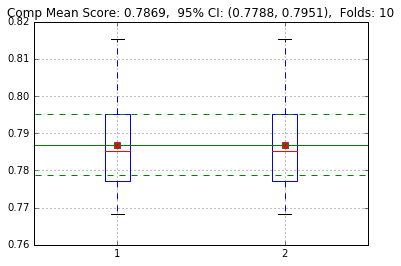


```python
def RowS_summary(da, rows, f = ["sum", "count"]):
    grp = da.loc[rows.index].groupby(rows, axis = 0)
    daop = pd.concat(map(lambda x: getattr(grp, x)(), f), keys = f, axis = 1)
    return(daop)
wcolxgb = WeightCI(WeightModel, modelxgbL)
wcolxgb.to_csv("{}/{}_w_xgb.csv".format(path, title))
RowS_summary(wcolxgb.iloc[:,0], Col_group(wcolxgb.index), ["sum", "count"]).rename(
    columns = {"sum": "Weights", "count": "Variable Numbers"}).plot(kind = "bar", title = "XGB Weight Distribution of Variables")
```


    <matplotlib.axes._subplots.AxesSubplot at 0x2a6b6c145f8>


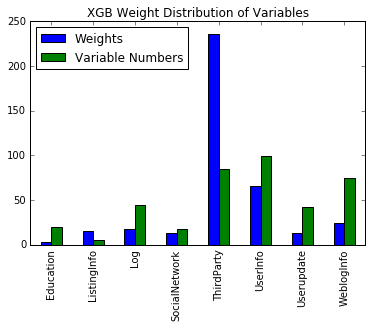


```python
pd.concat([wcollgr, wcolxgb], axis = 1, keys = ["LR", "XGB"]).to_csv("{}/{}_wcol.csv".format(path, title))
```
icx = list(wcolxgb.index[wcolxgb.iloc[:,0] > 0.0001])
x = dac.loc[:, icx]
x = x.apply(lambda x: x.fillna(x.median()),axis=0)
x = (x.rank(pct = True)-0.5/x.shape[0]).apply(st.norm.ppf)
# x = (x - x.mean())/x.std()
xv = x.loc[irv].values
x.shape

```python
modeldnnL = CrossTrain(x, y, irtL, DNN, parmodel = {"nhidlayer": 1, "rdrop": 0.5, "nhidnode": 600, "outnode": 300, 'optimizer': "rmsprop", 
                                                    "maxnorm": 4, "batch_size": 64, "earlystop": 5})
yt2pdnnL = CrossValid(x, y, irtL, modeldnnL)
CrossScoreAnalysis(y, [yt2pdnnL], irtL)
yvpdnnL = CrossPredict(xv, modeldnnL)
(pd.DataFrame({'score':ModelMPredict([yvpdnnL])}, index = irv).reset_index().rename_axis({"index": "Idx"}, axis = 1)
 .set_index("Idx").to_csv("{}/{}_op_dnn.csv".format(path, title)))
```

    Train on 71999 samples, validate on 8000 samples
    Epoch 1/100
    71999/71999 [==============================] - 26s - loss: 0.3021 - val_loss: 0.2414
    Epoch 2/100
    71999/71999 [==============================] - 27s - loss: 0.2421 - val_loss: 0.2357
    Epoch 3/100
    71999/71999 [==============================] - 27s - loss: 0.2363 - val_loss: 0.2361
    Epoch 4/100
    71999/71999 [==============================] - 27s - loss: 0.2316 - val_loss: 0.2403
    Epoch 5/100
    71999/71999 [==============================] - 29s - loss: 0.2294 - val_loss: 0.2372
    Epoch 6/100
    71999/71999 [==============================] - 28s - loss: 0.2281 - val_loss: 0.2350
    Epoch 7/100
    71999/71999 [==============================] - 31s - loss: 0.2258 - val_loss: 0.2356
    Epoch 8/100
    71999/71999 [==============================] - 31s - loss: 0.2244 - val_loss: 0.2370
    Epoch 9/100
    71999/71999 [==============================] - 32s - loss: 0.2229 - val_loss: 0.2366
    Epoch 10/100
    71999/71999 [==============================] - 32s - loss: 0.2223 - val_loss: 0.2379
    Epoch 11/100
    71999/71999 [==============================] - 31s - loss: 0.2194 - val_loss: 0.2374
    Epoch 12/100
    71999/71999 [==============================] - 33s - loss: 0.2195 - val_loss: 0.2409
    Score: 0.7669
    Time: 365.53 seconds
    Train on 71999 samples, validate on 8000 samples
    Epoch 1/100
    71999/71999 [==============================] - 37s - loss: 0.3056 - val_loss: 0.2469
    Epoch 2/100
    71999/71999 [==============================] - 34s - loss: 0.2409 - val_loss: 0.2393
    Epoch 3/100
    71999/71999 [==============================] - 33s - loss: 0.2358 - val_loss: 0.2356
    Epoch 4/100
    63296/71999 [=========================>....] - ETA: 4s - loss: 0.2318


    ---------------------------------------------------------------------------

    KeyboardInterrupt                         Traceback (most recent call last)

    <ipython-input-132-38dd28c5bc91> in <module>()
          1 modeldnnL = CrossTrain(x, y, irtL, DNN, parmodel = {"nhidlayer": 1, "rdrop": 0.5, "nhidnode": 600, "outnode": 300, 'optimizer': "rmsprop", 
    ----> 2                                                     "maxnorm": 4, "batch_size": 64, "earlystop": 5})
          3 yt2pdnnL = CrossValid(x, y, irtL, modeldnnL)
          4 CrossScoreAnalysis(y, [yt2pdnnL], irtL)
          5 yvpdnnL = CrossPredict(xv, modeldnnL)


    <ipython-input-19-e5c0f2cdcfd8> in CrossTrain(x, y, irtL, fmodel, **kwargs)
         17     for i in range(len(irtL)):
         18         xt1, xt2, yt1, yt2 = TrainSet(x, y, irtL, ig = i)
    ---> 19         modelL.append(fmodel(xt1, xt2, yt1, yt2, seed = i, **kwargs))
         20     return(modelL)
         21 def CrossValid(x, y, irtL, modelL):


    <ipython-input-102-69555e7dc01f> in DNN(xt1, xt2, yt1, yt2, seed, parmodel)
         23     model.compile(loss='binary_crossentropy', optimizer=par['optimizer'])
         24     model.fit(xt1.astype("float32"), yt1.astype("float32"), nb_epoch=100, batch_size=par["batch_size"], validation_data = (xt2, yt2), 
    ---> 25               callbacks = [EarlyStopping(monitor='val_loss', patience=par["earlystop"])])
         26     score = Score(yt2, ModelPredict(xt2, model))
         27     print("Time: {:.2f} seconds".format(time.time() - timestart))


    C:\Users\recre\Anaconda3\lib\site-packages\keras\engine\training.py in fit(self, x, y, batch_size, nb_epoch, verbose, callbacks, validation_split, validation_data, shuffle, class_weight, sample_weight)
       1009                               verbose=verbose, callbacks=callbacks,
       1010                               val_f=val_f, val_ins=val_ins, shuffle=shuffle,
    -> 1011                               callback_metrics=callback_metrics)
       1012 
       1013     def evaluate(self, x, y, batch_size=32, verbose=1, sample_weight=None):


    C:\Users\recre\Anaconda3\lib\site-packages\keras\engine\training.py in _fit_loop(self, f, ins, out_labels, batch_size, nb_epoch, verbose, callbacks, val_f, val_ins, shuffle, callback_metrics)
        747                 batch_logs['size'] = len(batch_ids)
        748                 callbacks.on_batch_begin(batch_index, batch_logs)
    --> 749                 outs = f(ins_batch)
        750                 if type(outs) != list:
        751                     outs = [outs]


    C:\Users\recre\Anaconda3\lib\site-packages\keras\backend\theano_backend.py in __call__(self, inputs)
        486     def __call__(self, inputs):
        487         assert type(inputs) in {list, tuple}
    --> 488         return self.function(*inputs)
        489 
        490 


    C:\Users\recre\Anaconda3\lib\site-packages\theano-0.8.0-py3.5.egg\theano\compile\function_module.py in __call__(self, *args, **kwargs)
        857         t0_fn = time.time()
        858         try:
    --> 859             outputs = self.fn()
        860         except Exception:
        861             if hasattr(self.fn, 'position_of_error'):


    C:\Users\recre\Anaconda3\lib\site-packages\theano-0.8.0-py3.5.egg\theano\gof\op.py in rval(p, i, o, n)
        912             # default arguments are stored in the closure of `rval`
        913             def rval(p=p, i=node_input_storage, o=node_output_storage, n=node):
    --> 914                 r = p(n, [x[0] for x in i], o)
        915                 for o in node.outputs:
        916                     compute_map[o][0] = True


    C:\Users\recre\Anaconda3\lib\site-packages\theano-0.8.0-py3.5.egg\theano\tensor\blas.py in perform(self, node, inp, out)
       1550         z, = out
       1551         try:
    -> 1552             z[0] = numpy.asarray(numpy.dot(x, y))
       1553         except ValueError as e:
       1554             # The error raised by numpy has no shape information, we mean to


    KeyboardInterrupt: 


## Composite Models and Prediction
Combine different types of models and get optimized weights for the composite prediction.


```python
score, score2, w = CrossScoreAnalysis(y, [yt2pxgbL, yt2plgrL], irtL, [0.9, 0.1], ["XGB+LR", "XGB", "LR"])
```

    Score: 0.7897
    Score: 0.7752
    Score: 0.7970
    Score: 0.7814
    Score: 0.7984
    Score: 0.7846
    Score: 0.8153
    Score: 0.7950
    Score: 0.7739
    Score: 0.7688
    Score: 0.7850
    Score: 0.7751
    Score: 0.7855
    Score: 0.7727
    Score: 0.7799
    Score: 0.7658
    Score: 0.7682
    Score: 0.7592
    Score: 0.7763
    Score: 0.7727
    Score: 0.7913
    Score: 0.7985
    Score: 0.7989
    Score: 0.8147
    Score: 0.7770
    Score: 0.7862
    Score: 0.7861
    Score: 0.7803
    Score: 0.7702
    Score: 0.7785


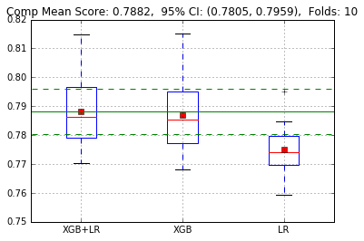


```python
score, score1, w = CrossScoreAnalysis(y, [yt2pxgbL, yt2pdnnL, yt2plgrL], irtL, [0.75, 0.20, 0.05], ["XGB+Keras+LR", "XGB", "Keras", "LR"])
ScorePlot(np.vstack([score1, score2, score.T]).T, ["XGB+Keras+LR", "XGB+LR", "XGB", "Keras", "LR"])
```

    Score: 0.7897
    Score: 0.7706
    Score: 0.7752
    Score: 0.7970
    Score: 0.7738
    Score: 0.7814
    Score: 0.7984
    Score: 0.7709
    Score: 0.7846
    Score: 0.8153
    Score: 0.7876
    Score: 0.7950
    Score: 0.7739
    Score: 0.7693
    Score: 0.7688
    Score: 0.7850
    Score: 0.7712
    Score: 0.7751
    Score: 0.7855
    Score: 0.7742
    Score: 0.7727
    Score: 0.7799
    Score: 0.7645
    Score: 0.7658
    Score: 0.7682
    Score: 0.7578
    Score: 0.7592
    Score: 0.7763
    Score: 0.7675
    Score: 0.7727
    Score: 0.7921
    Score: 0.7983
    Score: 0.7988
    Score: 0.8155
    Score: 0.7785
    Score: 0.7874
    Score: 0.7879
    Score: 0.7815
    Score: 0.7715
    Score: 0.7801


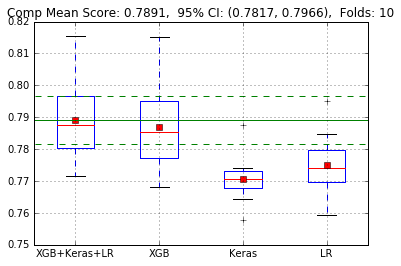


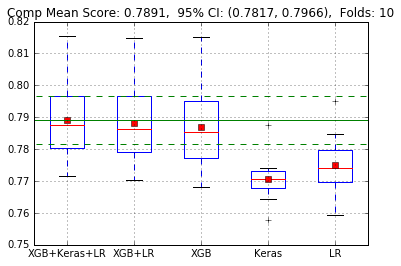


```python
def ModelWOpt(y, yt2pM, irtL, seed = 0):
    iw = ["w_{}".format(2+i) for i in range(len(yt2pM)-1)]
    space = dict(zip(*[iw, [hp.uniform(iw[i], 0, 1/len(yt2pM)) for i in range(len(yt2pM)-1)]]))
    def Obj(w):
        wtmp = [1-np.sum(list(w.values()))]+list(w.values())
        return({
            'loss': -np.mean(CrossScore(y, yt2pM, irtL, wtmp)),
            'status': STATUS_OK
            })
    np.random.seed(seed)
    trials = Trials()
    fmin(Obj,
        space=space,
        algo=tpe.suggest,
        max_evals=100,
        trials=trials)
    op = pd.concat([pd.DataFrame({"loss": trials.losses()}),
                    pd.DataFrame([sum(list(trials.trials[i]["misc"]["vals"].values()), []) for i in range(len(trials))],
                                 columns = list(trials.trials[0]["misc"]["vals"].keys()))], axis = 1)
    return(op)
```


```python
wopt = ModelWOpt(y, [yt2pxgbL, yt2pdnnL, yt2plgrL], irtL).sort_values(by = "loss")
wopt = wopt.assign(w_1 = 1 - wopt.iloc[:,1:].sum(axis = 1)).sort_index(axis = 1)
wcomp = wopt.iloc[0,1:].tolist()
wopt
```

    Score: 0.7892
    Score: 0.7943
    Score: 0.7962
    Score: 0.8129
    Score: 0.7758
    Score: 0.7852
    Score: 0.7852
    Score: 0.7796
    Score: 0.7696
    Score: 0.7781
    Score: 0.7909
    Score: 0.7967
    Score: 0.7978
    Score: 0.8164
    Score: 0.7764
    Score: 0.7871
    Score: 0.7877
    Score: 0.7821
    Score: 0.7715
    Score: 0.7790
    Score: 0.7884
    Score: 0.7929
    Score: 0.7941
    Score: 0.8105
    Score: 0.7763
    Score: 0.7843
    Score: 0.7851
    Score: 0.7782
    Score: 0.7693
    Score: 0.7786
    Score: 0.7865
    Score: 0.7905
    Score: 0.7924
    Score: 0.8078
    Score: 0.7749
    Score: 0.7825
    Score: 0.7831
    Score: 0.7763
    Score: 0.7674
    Score: 0.7777
    Score: 0.7900
    Score: 0.7963
    Score: 0.7976
    Score: 0.8154
    Score: 0.7752
    Score: 0.7861
    Score: 0.7861
    Score: 0.7812
    Score: 0.7704
    Score: 0.7778
    Score: 0.7900
    Score: 0.7958
    Score: 0.7973
    Score: 0.8148
    Score: 0.7759
    Score: 0.7861
    Score: 0.7862
    Score: 0.7809
    Score: 0.7705
    Score: 0.7783
    Score: 0.7907
    Score: 0.7966
    Score: 0.7979
    Score: 0.8161
    Score: 0.7761
    Score: 0.7868
    Score: 0.7872
    Score: 0.7820
    Score: 0.7712
    Score: 0.7787
    Score: 0.7909
    Score: 0.7962
    Score: 0.7970
    Score: 0.8153
    Score: 0.7771
    Score: 0.7868
    Score: 0.7877
    Score: 0.7815
    Score: 0.7716
    Score: 0.7794
    Score: 0.7901
    Score: 0.7967
    Score: 0.7980
    Score: 0.8168
    Score: 0.7746
    Score: 0.7867
    Score: 0.7869
    Score: 0.7821
    Score: 0.7706
    Score: 0.7777
    Score: 0.7884
    Score: 0.7930
    Score: 0.7946
    Score: 0.8109
    Score: 0.7760
    Score: 0.7844
    Score: 0.7849
    Score: 0.7783
    Score: 0.7691
    Score: 0.7784
    Score: 0.7900
    Score: 0.7949
    Score: 0.7959
    Score: 0.8133
    Score: 0.7770
    Score: 0.7858
    Score: 0.7867
    Score: 0.7802
    Score: 0.7708
    Score: 0.7792
    Score: 0.7901
    Score: 0.7967
    Score: 0.7980
    Score: 0.8167
    Score: 0.7746
    Score: 0.7866
    Score: 0.7869
    Score: 0.7820
    Score: 0.7706
    Score: 0.7776
    Score: 0.7888
    Score: 0.7961
    Score: 0.7974
    Score: 0.8164
    Score: 0.7729
    Score: 0.7859
    Score: 0.7861
    Score: 0.7816
    Score: 0.7694
    Score: 0.7762
    Score: 0.7876
    Score: 0.7921
    Score: 0.7942
    Score: 0.8100
    Score: 0.7751
    Score: 0.7837
    Score: 0.7838
    Score: 0.7777
    Score: 0.7681
    Score: 0.7777
    Score: 0.7889
    Score: 0.7942
    Score: 0.7961
    Score: 0.8128
    Score: 0.7755
    Score: 0.7851
    Score: 0.7849
    Score: 0.7794
    Score: 0.7694
    Score: 0.7778
    Score: 0.7870
    Score: 0.7914
    Score: 0.7938
    Score: 0.8092
    Score: 0.7746
    Score: 0.7832
    Score: 0.7831
    Score: 0.7770
    Score: 0.7675
    Score: 0.7773
    Score: 0.7865
    Score: 0.7905
    Score: 0.7923
    Score: 0.8077
    Score: 0.7750
    Score: 0.7825
    Score: 0.7831
    Score: 0.7762
    Score: 0.7674
    Score: 0.7778
    Score: 0.7878
    Score: 0.7921
    Score: 0.7936
    Score: 0.8096
    Score: 0.7758
    Score: 0.7837
    Score: 0.7844
    Score: 0.7776
    Score: 0.7687
    Score: 0.7783
    Score: 0.7904
    Score: 0.7959
    Score: 0.7966
    Score: 0.8158
    Score: 0.7770
    Score: 0.7872
    Score: 0.7882
    Score: 0.7818
    Score: 0.7717
    Score: 0.7793
    Score: 0.7875
    Score: 0.7924
    Score: 0.7946
    Score: 0.8104
    Score: 0.7748
    Score: 0.7838
    Score: 0.7835
    Score: 0.7778
    Score: 0.7679
    Score: 0.7773
    Score: 0.7902
    Score: 0.7962
    Score: 0.7974
    Score: 0.8169
    Score: 0.7758
    Score: 0.7873
    Score: 0.7881
    Score: 0.7823
    Score: 0.7713
    Score: 0.7787
    Score: 0.7909
    Score: 0.7963
    Score: 0.7973
    Score: 0.8155
    Score: 0.7769
    Score: 0.7868
    Score: 0.7876
    Score: 0.7816
    Score: 0.7716
    Score: 0.7792
    Score: 0.7910
    Score: 0.7966
    Score: 0.7975
    Score: 0.8161
    Score: 0.7768
    Score: 0.7871
    Score: 0.7879
    Score: 0.7820
    Score: 0.7717
    Score: 0.7792
    Score: 0.7909
    Score: 0.7967
    Score: 0.7979
    Score: 0.8164
    Score: 0.7762
    Score: 0.7871
    Score: 0.7876
    Score: 0.7821
    Score: 0.7715
    Score: 0.7789
    Score: 0.7907
    Score: 0.7960
    Score: 0.7972
    Score: 0.8150
    Score: 0.7768
    Score: 0.7866
    Score: 0.7872
    Score: 0.7813
    Score: 0.7713
    Score: 0.7792
    Score: 0.7895
    Score: 0.7945
    Score: 0.7961
    Score: 0.8130
    Score: 0.7762
    Score: 0.7855
    Score: 0.7857
    Score: 0.7797
    Score: 0.7700
    Score: 0.7785
    Score: 0.7907
    Score: 0.7958
    Score: 0.7967
    Score: 0.8147
    Score: 0.7771
    Score: 0.7866
    Score: 0.7873
    Score: 0.7811
    Score: 0.7714
    Score: 0.7793
    Score: 0.7897
    Score: 0.7949
    Score: 0.7966
    Score: 0.8137
    Score: 0.7761
    Score: 0.7857
    Score: 0.7859
    Score: 0.7802
    Score: 0.7702
    Score: 0.7784
    Score: 0.7900
    Score: 0.7949
    Score: 0.7962
    Score: 0.8134
    Score: 0.7767
    Score: 0.7858
    Score: 0.7863
    Score: 0.7801
    Score: 0.7706
    Score: 0.7790
    Score: 0.7909
    Score: 0.7966
    Score: 0.7977
    Score: 0.8162
    Score: 0.7766
    Score: 0.7871
    Score: 0.7878
    Score: 0.7820
    Score: 0.7716
    Score: 0.7791
    Score: 0.7900
    Score: 0.7960
    Score: 0.7975
    Score: 0.8170
    Score: 0.7753
    Score: 0.7873
    Score: 0.7878
    Score: 0.7822
    Score: 0.7709
    Score: 0.7784
    Score: 0.7907
    Score: 0.7961
    Score: 0.7968
    Score: 0.8155
    Score: 0.7772
    Score: 0.7871
    Score: 0.7880
    Score: 0.7817
    Score: 0.7718
    Score: 0.7794
    Score: 0.7879
    Score: 0.7923
    Score: 0.7942
    Score: 0.8102
    Score: 0.7755
    Score: 0.7839
    Score: 0.7842
    Score: 0.7778
    Score: 0.7686
    Score: 0.7781
    Score: 0.7905
    Score: 0.7956
    Score: 0.7964
    Score: 0.8143
    Score: 0.7771
    Score: 0.7864
    Score: 0.7872
    Score: 0.7808
    Score: 0.7713
    Score: 0.7793
    Score: 0.7905
    Score: 0.7957
    Score: 0.7970
    Score: 0.8146
    Score: 0.7767
    Score: 0.7864
    Score: 0.7869
    Score: 0.7809
    Score: 0.7710
    Score: 0.7790
    Score: 0.7906
    Score: 0.7967
    Score: 0.7980
    Score: 0.8169
    Score: 0.7758
    Score: 0.7872
    Score: 0.7878
    Score: 0.7823
    Score: 0.7713
    Score: 0.7787
    Score: 0.7908
    Score: 0.7968
    Score: 0.7980
    Score: 0.8165
    Score: 0.7760
    Score: 0.7870
    Score: 0.7875
    Score: 0.7821
    Score: 0.7713
    Score: 0.7787
    Score: 0.7899
    Score: 0.7954
    Score: 0.7970
    Score: 0.8143
    Score: 0.7760
    Score: 0.7859
    Score: 0.7861
    Score: 0.7805
    Score: 0.7704
    Score: 0.7784
    Score: 0.7909
    Score: 0.7962
    Score: 0.7972
    Score: 0.8153
    Score: 0.7769
    Score: 0.7868
    Score: 0.7876
    Score: 0.7815
    Score: 0.7716
    Score: 0.7793
    Score: 0.7890
    Score: 0.7936
    Score: 0.7948
    Score: 0.8114
    Score: 0.7765
    Score: 0.7848
    Score: 0.7855
    Score: 0.7788
    Score: 0.7697
    Score: 0.7787
    Score: 0.7900
    Score: 0.7949
    Score: 0.7960
    Score: 0.8133
    Score: 0.7769
    Score: 0.7858
    Score: 0.7865
    Score: 0.7801
    Score: 0.7707
    Score: 0.7791
    Score: 0.7910
    Score: 0.7966
    Score: 0.7976
    Score: 0.8161
    Score: 0.7766
    Score: 0.7870
    Score: 0.7877
    Score: 0.7819
    Score: 0.7716
    Score: 0.7791
    Score: 0.7895
    Score: 0.7965
    Score: 0.7978
    Score: 0.8167
    Score: 0.7739
    Score: 0.7864
    Score: 0.7867
    Score: 0.7819
    Score: 0.7702
    Score: 0.7771
    Score: 0.7905
    Score: 0.7956
    Score: 0.7966
    Score: 0.8143
    Score: 0.7770
    Score: 0.7863
    Score: 0.7870
    Score: 0.7808
    Score: 0.7712
    Score: 0.7792
    Score: 0.7908
    Score: 0.7963
    Score: 0.7970
    Score: 0.8159
    Score: 0.7770
    Score: 0.7872
    Score: 0.7881
    Score: 0.7819
    Score: 0.7718
    Score: 0.7794
    Score: 0.7905
    Score: 0.7955
    Score: 0.7963
    Score: 0.8142
    Score: 0.7772
    Score: 0.7864
    Score: 0.7873
    Score: 0.7808
    Score: 0.7714
    Score: 0.7794
    Score: 0.7896
    Score: 0.7960
    Score: 0.7976
    Score: 0.8170
    Score: 0.7743
    Score: 0.7870
    Score: 0.7873
    Score: 0.7821
    Score: 0.7703
    Score: 0.7776
    Score: 0.7903
    Score: 0.7958
    Score: 0.7973
    Score: 0.8148
    Score: 0.7762
    Score: 0.7863
    Score: 0.7865
    Score: 0.7810
    Score: 0.7708
    Score: 0.7786
    Score: 0.7909
    Score: 0.7967
    Score: 0.7979
    Score: 0.8165
    Score: 0.7763
    Score: 0.7872
    Score: 0.7877
    Score: 0.7822
    Score: 0.7715
    Score: 0.7789
    Score: 0.7905
    Score: 0.7966
    Score: 0.7978
    Score: 0.8170
    Score: 0.7757
    Score: 0.7873
    Score: 0.7879
    Score: 0.7823
    Score: 0.7713
    Score: 0.7786
    Score: 0.7881
    Score: 0.7926
    Score: 0.7946
    Score: 0.8106
    Score: 0.7755
    Score: 0.7841
    Score: 0.7844
    Score: 0.7781
    Score: 0.7687
    Score: 0.7781
    Score: 0.7902
    Score: 0.7952
    Score: 0.7956
    Score: 0.8135
    Score: 0.7774
    Score: 0.7861
    Score: 0.7873
    Score: 0.7804
    Score: 0.7712
    Score: 0.7793
    Score: 0.7905
    Score: 0.7968
    Score: 0.7981
    Score: 0.8167
    Score: 0.7752
    Score: 0.7869
    Score: 0.7871
    Score: 0.7822
    Score: 0.7709
    Score: 0.7781
    Score: 0.7906
    Score: 0.7960
    Score: 0.7974
    Score: 0.8151
    Score: 0.7766
    Score: 0.7865
    Score: 0.7870
    Score: 0.7812
    Score: 0.7711
    Score: 0.7789
    Score: 0.7902
    Score: 0.7964
    Score: 0.7978
    Score: 0.8171
    Score: 0.7750
    Score: 0.7872
    Score: 0.7876
    Score: 0.7823
    Score: 0.7709
    Score: 0.7782
    Score: 0.7890
    Score: 0.7943
    Score: 0.7962
    Score: 0.8130
    Score: 0.7755
    Score: 0.7851
    Score: 0.7849
    Score: 0.7795
    Score: 0.7694
    Score: 0.7777
    Score: 0.7901
    Score: 0.7967
    Score: 0.7980
    Score: 0.8162
    Score: 0.7750
    Score: 0.7865
    Score: 0.7866
    Score: 0.7818
    Score: 0.7706
    Score: 0.7777
    Score: 0.7897
    Score: 0.7950
    Score: 0.7967
    Score: 0.8138
    Score: 0.7761
    Score: 0.7857
    Score: 0.7858
    Score: 0.7802
    Score: 0.7702
    Score: 0.7783
    Score: 0.7908
    Score: 0.7964
    Score: 0.7973
    Score: 0.8163
    Score: 0.7768
    Score: 0.7873
    Score: 0.7882
    Score: 0.7821
    Score: 0.7718
    Score: 0.7793
    Score: 0.7866
    Score: 0.7908
    Score: 0.7930
    Score: 0.8083
    Score: 0.7747
    Score: 0.7828
    Score: 0.7830
    Score: 0.7766
    Score: 0.7673
    Score: 0.7775
    Score: 0.7904
    Score: 0.7958
    Score: 0.7963
    Score: 0.8154
    Score: 0.7772
    Score: 0.7871
    Score: 0.7882
    Score: 0.7815
    Score: 0.7717
    Score: 0.7793
    Score: 0.7906
    Score: 0.7960
    Score: 0.7967
    Score: 0.8156
    Score: 0.7771
    Score: 0.7871
    Score: 0.7881
    Score: 0.7817
    Score: 0.7717
    Score: 0.7794
    Score: 0.7890
    Score: 0.7937
    Score: 0.7951
    Score: 0.8117
    Score: 0.7764
    Score: 0.7849
    Score: 0.7854
    Score: 0.7790
    Score: 0.7697
    Score: 0.7786
    Score: 0.7901
    Score: 0.7951
    Score: 0.7964
    Score: 0.8137
    Score: 0.7767
    Score: 0.7859
    Score: 0.7865
    Score: 0.7803
    Score: 0.7707
    Score: 0.7790
    Score: 0.7885
    Score: 0.7931
    Score: 0.7949
    Score: 0.8111
    Score: 0.7758
    Score: 0.7844
    Score: 0.7847
    Score: 0.7785
    Score: 0.7690
    Score: 0.7782
    Score: 0.7908
    Score: 0.7965
    Score: 0.7978
    Score: 0.8160
    Score: 0.7763
    Score: 0.7868
    Score: 0.7873
    Score: 0.7818
    Score: 0.7713
    Score: 0.7788
    Score: 0.7909
    Score: 0.7967
    Score: 0.7978
    Score: 0.8164
    Score: 0.7764
    Score: 0.7871
    Score: 0.7878
    Score: 0.7821
    Score: 0.7715
    Score: 0.7790
    Score: 0.7909
    Score: 0.7964
    Score: 0.7972
    Score: 0.8157
    Score: 0.7769
    Score: 0.7870
    Score: 0.7878
    Score: 0.7818
    Score: 0.7717
    Score: 0.7793
    Score: 0.7905
    Score: 0.7955
    Score: 0.7963
    Score: 0.8141
    Score: 0.7771
    Score: 0.7863
    Score: 0.7871
    Score: 0.7808
    Score: 0.7712
    Score: 0.7793
    Score: 0.7902
    Score: 0.7962
    Score: 0.7976
    Score: 0.8170
    Score: 0.7755
    Score: 0.7874
    Score: 0.7880
    Score: 0.7823
    Score: 0.7711
    Score: 0.7786
    Score: 0.7905
    Score: 0.7965
    Score: 0.7978
    Score: 0.8170
    Score: 0.7757
    Score: 0.7873
    Score: 0.7879
    Score: 0.7823
    Score: 0.7713
    Score: 0.7786
    Score: 0.7909
    Score: 0.7963
    Score: 0.7972
    Score: 0.8158
    Score: 0.7770
    Score: 0.7871
    Score: 0.7880
    Score: 0.7819
    Score: 0.7718
    Score: 0.7794
    Score: 0.7899
    Score: 0.7947
    Score: 0.7955
    Score: 0.8129
    Score: 0.7771
    Score: 0.7857
    Score: 0.7867
    Score: 0.7799
    Score: 0.7708
    Score: 0.7792
    Score: 0.7907
    Score: 0.7959
    Score: 0.7966
    Score: 0.8149
    Score: 0.7773
    Score: 0.7868
    Score: 0.7877
    Score: 0.7813
    Score: 0.7716
    Score: 0.7794
    Score: 0.7904
    Score: 0.7968
    Score: 0.7981
    Score: 0.8168
    Score: 0.7751
    Score: 0.7869
    Score: 0.7872
    Score: 0.7822
    Score: 0.7709
    Score: 0.7781
    Score: 0.7903
    Score: 0.7957
    Score: 0.7962
    Score: 0.8154
    Score: 0.7772
    Score: 0.7871
    Score: 0.7882
    Score: 0.7815
    Score: 0.7717
    Score: 0.7793
    Score: 0.7906
    Score: 0.7959
    Score: 0.7970
    Score: 0.8148
    Score: 0.7769
    Score: 0.7865
    Score: 0.7872
    Score: 0.7811
    Score: 0.7712
    Score: 0.7792
    Score: 0.7907
    Score: 0.7959
    Score: 0.7968
    Score: 0.8149
    Score: 0.7771
    Score: 0.7867
    Score: 0.7875
    Score: 0.7812
    Score: 0.7715
    Score: 0.7794
    Score: 0.7900
    Score: 0.7959
    Score: 0.7972
    Score: 0.8168
    Score: 0.7756
    Score: 0.7874
    Score: 0.7880
    Score: 0.7822
    Score: 0.7711
    Score: 0.7787
    Score: 0.7903
    Score: 0.7956
    Score: 0.7969
    Score: 0.8144
    Score: 0.7766
    Score: 0.7862
    Score: 0.7867
    Score: 0.7808
    Score: 0.7709
    Score: 0.7790
    Score: 0.7906
    Score: 0.7965
    Score: 0.7978
    Score: 0.8159
    Score: 0.7761
    Score: 0.7867
    Score: 0.7870
    Score: 0.7818
    Score: 0.7712
    Score: 0.7786
    Score: 0.7906
    Score: 0.7958
    Score: 0.7963
    Score: 0.8147
    Score: 0.7773
    Score: 0.7868
    Score: 0.7878
    Score: 0.7812
    Score: 0.7716
    Score: 0.7794
    Score: 0.7896
    Score: 0.7944
    Score: 0.7957
    Score: 0.8126
    Score: 0.7766
    Score: 0.7854
    Score: 0.7860
    Score: 0.7796
    Score: 0.7703
    Score: 0.7789
    Score: 0.7903
    Score: 0.7959
    Score: 0.7967
    Score: 0.8161
    Score: 0.7767
    Score: 0.7873
    Score: 0.7882
    Score: 0.7820
    Score: 0.7716
    Score: 0.7792
    Score: 0.7907
    Score: 0.7967
    Score: 0.7979
    Score: 0.8169
    Score: 0.7759
    Score: 0.7873
    Score: 0.7878
    Score: 0.7823
    Score: 0.7714
    Score: 0.7787
    Score: 0.7909
    Score: 0.7967
    Score: 0.7978
    Score: 0.8166
    Score: 0.7764
    Score: 0.7872
    Score: 0.7879
    Score: 0.7822
    Score: 0.7716
    Score: 0.7791
    Score: 0.7902
    Score: 0.7963
    Score: 0.7977
    Score: 0.8170
    Score: 0.7754
    Score: 0.7873
    Score: 0.7879
    Score: 0.7823
    Score: 0.7711
    Score: 0.7784
    Score: 0.7908
    Score: 0.7968
    Score: 0.7980
    Score: 0.8167
    Score: 0.7761
    Score: 0.7872
    Score: 0.7877
    Score: 0.7822
    Score: 0.7714
    Score: 0.7788
    Score: 0.7907
    Score: 0.7967
    Score: 0.7979
    Score: 0.8162
    Score: 0.7761
    Score: 0.7869
    Score: 0.7872
    Score: 0.7820
    Score: 0.7713
    Score: 0.7787
    Score: 0.7877
    Score: 0.7921
    Score: 0.7941
    Score: 0.8100
    Score: 0.7752
    Score: 0.7837
    Score: 0.7840
    Score: 0.7777
    Score: 0.7682
    Score: 0.7779
    Score: 0.7902
    Score: 0.7957
    Score: 0.7972
    Score: 0.8147
    Score: 0.7761
    Score: 0.7861
    Score: 0.7864
    Score: 0.7809
    Score: 0.7707
    Score: 0.7785
    Score: 0.7905
    Score: 0.7960
    Score: 0.7974
    Score: 0.8151
    Score: 0.7764
    Score: 0.7865
    Score: 0.7868
    Score: 0.7812
    Score: 0.7710
    Score: 0.7788
    Score: 0.7899
    Score: 0.7950
    Score: 0.7964
    Score: 0.8135
    Score: 0.7765
    Score: 0.7858
    Score: 0.7862
    Score: 0.7801
    Score: 0.7705
    Score: 0.7788
    Score: 0.7907
    Score: 0.7960
    Score: 0.7970
    Score: 0.8149
    Score: 0.7769
    Score: 0.7866
    Score: 0.7873
    Score: 0.7812
    Score: 0.7714
    Score: 0.7792
    Score: 0.7905
    Score: 0.7966
    Score: 0.7979
    Score: 0.8170
    Score: 0.7757
    Score: 0.7873
    Score: 0.7879
    Score: 0.7824
    Score: 0.7713
    Score: 0.7786
    Score: 0.7909
    Score: 0.7967
    Score: 0.7979
    Score: 0.8164
    Score: 0.7763
    Score: 0.7871
    Score: 0.7877
    Score: 0.7821
    Score: 0.7715
    Score: 0.7789
    Score: 0.7895
    Score: 0.7944
    Score: 0.7960
    Score: 0.8128
    Score: 0.7762
    Score: 0.7854
    Score: 0.7857
    Score: 0.7796
    Score: 0.7700
    Score: 0.7785
    Score: 0.7902
    Score: 0.7967
    Score: 0.7980
    Score: 0.8166
    Score: 0.7747
    Score: 0.7866
    Score: 0.7869
    Score: 0.7820
    Score: 0.7707
    Score: 0.7777
    Score: 0.7901
    Score: 0.7960
    Score: 0.7972
    Score: 0.8167
    Score: 0.7759
    Score: 0.7874
    Score: 0.7881
    Score: 0.7822
    Score: 0.7713
    Score: 0.7788
    Score: 0.7908
    Score: 0.7961
    Score: 0.7968
    Score: 0.8152
    Score: 0.7772
    Score: 0.7869
    Score: 0.7877
    Score: 0.7815
    Score: 0.7717
    Score: 0.7794


<div>
<table border="1" class="dataframe">
  <thead>
    <tr style="text-align: right;">
      <th></th>
      <th>loss</th>
      <th>w_1</th>
      <th>w_2</th>
      <th>w_3</th>
    </tr>
  </thead>
  <tbody>
    <tr>
      <th>58</th>
      <td>-0.788618</td>
      <td>0.728990</td>
      <td>0.232908</td>
      <td>0.038102</td>
    </tr>
    <tr>
      <th>85</th>
      <td>-0.788616</td>
      <td>0.784017</td>
      <td>0.165579</td>
      <td>0.050403</td>
    </tr>
    <tr>
      <th>66</th>
      <td>-0.788586</td>
      <td>0.784012</td>
      <td>0.156592</td>
      <td>0.059396</td>
    </tr>
    <tr>
      <th>22</th>
      <td>-0.788581</td>
      <td>0.736678</td>
      <td>0.201663</td>
      <td>0.061658</td>
    </tr>
    <tr>
      <th>48</th>
      <td>-0.788578</td>
      <td>0.795136</td>
      <td>0.148876</td>
      <td>0.055988</td>
    </tr>
    <tr>
      <th>84</th>
      <td>-0.788565</td>
      <td>0.815762</td>
      <td>0.147840</td>
      <td>0.036398</td>
    </tr>
    <tr>
      <th>87</th>
      <td>-0.788563</td>
      <td>0.812743</td>
      <td>0.136994</td>
      <td>0.050263</td>
    </tr>
    <tr>
      <th>29</th>
      <td>-0.788559</td>
      <td>0.761273</td>
      <td>0.172879</td>
      <td>0.065848</td>
    </tr>
    <tr>
      <th>1</th>
      <td>-0.788555</td>
      <td>0.786718</td>
      <td>0.148842</td>
      <td>0.064440</td>
    </tr>
    <tr>
      <th>95</th>
      <td>-0.788547</td>
      <td>0.795134</td>
      <td>0.141978</td>
      <td>0.062888</td>
    </tr>
    <tr>
      <th>71</th>
      <td>-0.788542</td>
      <td>0.708028</td>
      <td>0.233437</td>
      <td>0.058535</td>
    </tr>
    <tr>
      <th>23</th>
      <td>-0.788537</td>
      <td>0.800727</td>
      <td>0.136284</td>
      <td>0.062990</td>
    </tr>
    <tr>
      <th>44</th>
      <td>-0.788534</td>
      <td>0.698568</td>
      <td>0.255587</td>
      <td>0.045845</td>
    </tr>
    <tr>
      <th>35</th>
      <td>-0.788531</td>
      <td>0.826637</td>
      <td>0.140331</td>
      <td>0.033032</td>
    </tr>
    <tr>
      <th>41</th>
      <td>-0.788515</td>
      <td>0.757528</td>
      <td>0.169622</td>
      <td>0.072850</td>
    </tr>
    <tr>
      <th>94</th>
      <td>-0.788507</td>
      <td>0.823385</td>
      <td>0.152417</td>
      <td>0.024197</td>
    </tr>
    <tr>
      <th>70</th>
      <td>-0.788486</td>
      <td>0.820263</td>
      <td>0.159480</td>
      <td>0.020257</td>
    </tr>
    <tr>
      <th>49</th>
      <td>-0.788484</td>
      <td>0.821314</td>
      <td>0.158067</td>
      <td>0.020619</td>
    </tr>
    <tr>
      <th>67</th>
      <td>-0.788482</td>
      <td>0.715232</td>
      <td>0.213334</td>
      <td>0.071434</td>
    </tr>
    <tr>
      <th>36</th>
      <td>-0.788465</td>
      <td>0.820910</td>
      <td>0.115425</td>
      <td>0.063665</td>
    </tr>
    <tr>
      <th>31</th>
      <td>-0.788436</td>
      <td>0.675826</td>
      <td>0.272706</td>
      <td>0.051468</td>
    </tr>
    <tr>
      <th>20</th>
      <td>-0.788416</td>
      <td>0.788860</td>
      <td>0.202388</td>
      <td>0.008752</td>
    </tr>
    <tr>
      <th>61</th>
      <td>-0.788414</td>
      <td>0.671778</td>
      <td>0.286875</td>
      <td>0.041347</td>
    </tr>
    <tr>
      <th>83</th>
      <td>-0.788396</td>
      <td>0.704287</td>
      <td>0.280064</td>
      <td>0.015649</td>
    </tr>
    <tr>
      <th>18</th>
      <td>-0.788386</td>
      <td>0.680404</td>
      <td>0.295400</td>
      <td>0.024196</td>
    </tr>
    <tr>
      <th>69</th>
      <td>-0.788373</td>
      <td>0.810996</td>
      <td>0.181131</td>
      <td>0.007873</td>
    </tr>
    <tr>
      <th>21</th>
      <td>-0.788370</td>
      <td>0.716726</td>
      <td>0.197244</td>
      <td>0.086030</td>
    </tr>
    <tr>
      <th>88</th>
      <td>-0.788368</td>
      <td>0.809763</td>
      <td>0.108089</td>
      <td>0.082148</td>
    </tr>
    <tr>
      <th>86</th>
      <td>-0.788364</td>
      <td>0.827252</td>
      <td>0.162893</td>
      <td>0.009854</td>
    </tr>
    <tr>
      <th>98</th>
      <td>-0.788361</td>
      <td>0.768457</td>
      <td>0.226720</td>
      <td>0.004822</td>
    </tr>
    <tr>
      <th>...</th>
      <td>...</td>
      <td>...</td>
      <td>...</td>
      <td>...</td>
    </tr>
    <tr>
      <th>37</th>
      <td>-0.787392</td>
      <td>0.752088</td>
      <td>0.084900</td>
      <td>0.163012</td>
    </tr>
    <tr>
      <th>10</th>
      <td>-0.787391</td>
      <td>0.594449</td>
      <td>0.268884</td>
      <td>0.136667</td>
    </tr>
    <tr>
      <th>40</th>
      <td>-0.787340</td>
      <td>0.606683</td>
      <td>0.246215</td>
      <td>0.147101</td>
    </tr>
    <tr>
      <th>28</th>
      <td>-0.787311</td>
      <td>0.632518</td>
      <td>0.209416</td>
      <td>0.158065</td>
    </tr>
    <tr>
      <th>92</th>
      <td>-0.787263</td>
      <td>0.656741</td>
      <td>0.176311</td>
      <td>0.166949</td>
    </tr>
    <tr>
      <th>72</th>
      <td>-0.787245</td>
      <td>0.561980</td>
      <td>0.306845</td>
      <td>0.131175</td>
    </tr>
    <tr>
      <th>57</th>
      <td>-0.787158</td>
      <td>0.719051</td>
      <td>0.101867</td>
      <td>0.179082</td>
    </tr>
    <tr>
      <th>27</th>
      <td>-0.787146</td>
      <td>0.704557</td>
      <td>0.115940</td>
      <td>0.179503</td>
    </tr>
    <tr>
      <th>12</th>
      <td>-0.787068</td>
      <td>0.978582</td>
      <td>0.007704</td>
      <td>0.013714</td>
    </tr>
    <tr>
      <th>82</th>
      <td>-0.786896</td>
      <td>0.588669</td>
      <td>0.236416</td>
      <td>0.174915</td>
    </tr>
    <tr>
      <th>25</th>
      <td>-0.786888</td>
      <td>0.649747</td>
      <td>0.159375</td>
      <td>0.190878</td>
    </tr>
    <tr>
      <th>96</th>
      <td>-0.786822</td>
      <td>0.638533</td>
      <td>0.168463</td>
      <td>0.193004</td>
    </tr>
    <tr>
      <th>0</th>
      <td>-0.786601</td>
      <td>0.695079</td>
      <td>0.092394</td>
      <td>0.212527</td>
    </tr>
    <tr>
      <th>55</th>
      <td>-0.786466</td>
      <td>0.730046</td>
      <td>0.050345</td>
      <td>0.219609</td>
    </tr>
    <tr>
      <th>14</th>
      <td>-0.786408</td>
      <td>0.716213</td>
      <td>0.060431</td>
      <td>0.223356</td>
    </tr>
    <tr>
      <th>62</th>
      <td>-0.786352</td>
      <td>0.553441</td>
      <td>0.244585</td>
      <td>0.201974</td>
    </tr>
    <tr>
      <th>39</th>
      <td>-0.786288</td>
      <td>0.518291</td>
      <td>0.291094</td>
      <td>0.190615</td>
    </tr>
    <tr>
      <th>64</th>
      <td>-0.785820</td>
      <td>0.565279</td>
      <td>0.190479</td>
      <td>0.244241</td>
    </tr>
    <tr>
      <th>9</th>
      <td>-0.785786</td>
      <td>0.523688</td>
      <td>0.244490</td>
      <td>0.231822</td>
    </tr>
    <tr>
      <th>2</th>
      <td>-0.785763</td>
      <td>0.472938</td>
      <td>0.318962</td>
      <td>0.208100</td>
    </tr>
    <tr>
      <th>50</th>
      <td>-0.785481</td>
      <td>0.545966</td>
      <td>0.191942</td>
      <td>0.262092</td>
    </tr>
    <tr>
      <th>32</th>
      <td>-0.785273</td>
      <td>0.512554</td>
      <td>0.221360</td>
      <td>0.266086</td>
    </tr>
    <tr>
      <th>17</th>
      <td>-0.785156</td>
      <td>0.447257</td>
      <td>0.309283</td>
      <td>0.243459</td>
    </tr>
    <tr>
      <th>89</th>
      <td>-0.785057</td>
      <td>0.525622</td>
      <td>0.188505</td>
      <td>0.285872</td>
    </tr>
    <tr>
      <th>19</th>
      <td>-0.785014</td>
      <td>0.611984</td>
      <td>0.083361</td>
      <td>0.304655</td>
    </tr>
    <tr>
      <th>13</th>
      <td>-0.785014</td>
      <td>0.546782</td>
      <td>0.159170</td>
      <td>0.294047</td>
    </tr>
    <tr>
      <th>15</th>
      <td>-0.784419</td>
      <td>0.532776</td>
      <td>0.134510</td>
      <td>0.332715</td>
    </tr>
    <tr>
      <th>59</th>
      <td>-0.784051</td>
      <td>0.440193</td>
      <td>0.228934</td>
      <td>0.330873</td>
    </tr>
    <tr>
      <th>16</th>
      <td>-0.783898</td>
      <td>0.367938</td>
      <td>0.331395</td>
      <td>0.300667</td>
    </tr>
    <tr>
      <th>3</th>
      <td>-0.783897</td>
      <td>0.384960</td>
      <td>0.301646</td>
      <td>0.313395</td>
    </tr>
  </tbody>
</table>
<p>100 rows × 4 columns</p>
</div>


```python
opcomp = pd.DataFrame({'score':ModelMPredict([yvpxgbL, yvpdnnL, yvplgrL], [0.75, 0.20, 0.05])}, index = irv).reset_index().rename_axis({"index": "Idx"}, axis = 1).set_index("Idx")
opcomp.to_csv("{}/{}_op.csv".format(path, title))
```
